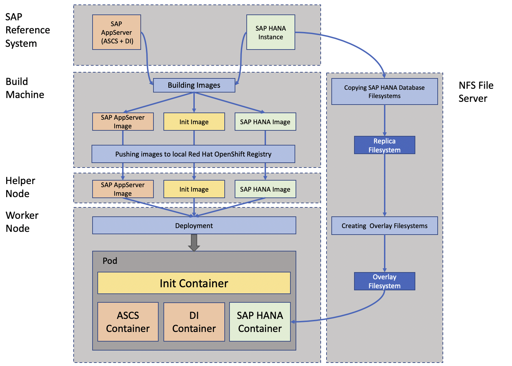

<!--
  ------------------------------------------------------------------------
  Copyright 2020 IBM Corp. All Rights Reserved.

  Licensed under the Apache License, Version 2.0 (the "License");
  you may not use this file except in compliance with the License.
  You may obtain a copy of the License at

      http://www.apache.org/licenses/LICENSE-2.0

  Unless required by applicable law or agreed to in writing, software
  distributed under the License is distributed on an "AS IS" BASIS,
  WITHOUT WARRANTIES OR CONDITIONS OF ANY KIND, either express or implied.
  See the License for the specific language governing permissions and
  limitations under the License.
  ------------------------------------------------------------------------
-->

# Containerization by IBM for SAP S/4HANA with Red Hat OpenShift

[](https://www.apache.org/licenses/LICENSE-2.0)
<!--
[](https://cla-assistant.io/IBM/containerization-for-sap-s4hana)
-->

Build container images from existing SAP® NetWeaver® and SAP® S/4HANA®
systems and run them on a Red Hat® OpenShift® cluster.

## Contents

<details>
  <summary>Table of Contents</summary>

- [Introduction](#introduction)
  - [Build and deployment options](#build-and-deployment-options)
  - [Architecture and workflow](#architecture-and-workflow)
  - [Important note](#important-note)
- [Prerequisites](#prerequisites)
  - [NFS server setup](#nfs-server-setup)
  - [Build and deploy prerequisites](#build-and-deploy-prerequisites)
  - [Red Hat OpenShift prerequisites](#red-hat-openshift-prerequisites)
- [Preparing the configuration file](#preparing-the-configuration-file)
- [General command line parameters](#general-command-line-parameters)
- [Automated build and deployment](#automated-build-and-deployment)
- [Manual build](#manual-build)
  - [Creating a snapshot copy of the reference database](#creating-a-snapshot-copy-of-the-reference-database)
  - [Building the container images at once](#building-the-container-images-at-once)
  - [Building the container images separately](#building-the-container-images-separately)
- [Manual push](#manual-push)
- [Manual start](#manual-start)
  - [Creating a database overlay share on the NFS server](#creating-a-database-overlay-share-on-the-nfs-server)
  - [Generating a deployment description file](#generating-a-deployment-description-file)
  - [Starting the SAP system on the Red Hat OpenShift cluster](#starting-the-sap-system-on-the-red-hat-openshift-cluster)
- [Verifying the correct start of the SAP system](#verifying-the-correct-start-of-the-sap-system)
- [Logging into a container](#logging-into-a-container)
- [Connecting to the SAP system](#connecting-to-the-sap-system)
- [Testing the images locally](#testing-the-images-locally)
- [Contributors](#contributors)
- [License](#license)
- [Acknowledgments](#acknowledgments)

</details>

## Introduction

This project provides assets for building container images from
existing SAP systems and deploying containers based on the created
images in a Red Hat OpenShift cluster running on IBM Power® Systems.

### Build and deployment options

We provide three build and deployment options:

- using Python scripts from the command line
- using [Red Hat Ansible®](ansible/README.md#building-and-deploying-with-red-hat-ansible) scripts from the command line
- using [Red Hat Ansible Tower®](ansible/README.md#building-and-deploying-with-red-hat-ansible-tower).

### Architecture and workflow

The following picture describes the steps that are executed during
image build and container deployment:



The reference SAP system must be a central system, i.e. all instances
including the database of the system must reside on one host. We
tested our solution with SAP NetWeaver and SAP S/4HANA reference
systems.

During the build phase three different images are created:

- *Init* image: This image is reference-system-independent and is used
  during the initialization of the deployment in the cluster.

- *SAP AppServer* image: This image contains all relevant components
  of the reference system that are needed to start both the *ABAP SAP
  Central Services* (ASCS) and the *Dialog Instance* (DI) containers.

- *SAP HANA* image: This image contains the SAP HANA® instance
  directories. It does not contain the `data/` and the `log/`
  directory trees of the database. A snapshot of these two
  directory trees is copied to the NFS file server during the build
  phase. At deployment time an overlay file system is created on top of
  the snapshot and mounted into the SAP HANA container.

The images are pushed into the internal cluster registry. At
deployment time the images are copied to the cluster helper node on
which the deployment is started. At deployment start the init
container sets up the environments for the application containers
(ASCS, DI and SAP HANA containers). These are started after the init
container has terminated. During startup of the SAP HANA container the
overlay file system is mounted into the container.


In the following we describe how to

- adapt the needed environment such as the build machine, the NFS
  servers and the Red Hat OpenShift helper and worker nodes

- build the images and deploy containers based on the images

for running an SAP system in a Red Hat OpenShift cluster.

Please refer also to this [IBM®
Redpaper](http://www.redbooks.ibm.com/Redbooks.nsf/RedpieceAbstracts/redp5619.html?Open)
for more information on how to setup the required environment.

### Important note

**This is a beta release and targets for test and other non-production
landscapes. The created deliverables are not supported by SAP nor
agreed to a roadmap for official support in current state (see also
SAP Note 1122387 - *Linux: SAP Support in virtualized environments*)**

## Prerequisites

### NFS server setup

During image build a snapshot copy of the reference database is
created. This copy is accessed by the running SAP HANA container via
NFS. Therefore you need to setup a NFS server in your landscape which

- has enough storage space to hold multiple copies of SAP HANA
  databases (order of magnitude: terabyte)

- allows root access via SSH.

### Build and deploy prerequisites

> :warning: **The build machine should be different from the cluster
> helper node. All actions described in the following should be
> performed on the build machine, not on the helper node.**

- The following software packages need to be installed on the build machine:

  | Package    | Description |
  |:-----------|:----------|
  | `git`      | Version control system |
  | `podman`   | Tool for building container images and running containers |
  | `oc`       | Command line interface tool for Red Hat OpenShift |
  | `python3`  | Script interpreter |
  | `paramiko` | Python 3 SSH client (available via [EPEL](https://www.redhat.com/en/blog/whats-epel-and-how-do-i-use-it) on RHEL 8) |

- You need a clone of this repository on your build machine. Create
  the clone by logging into the build machine and running the command

  ```shell
  $ git clone https://github.com/IBM/containerization-for-sap-s4hana.git
  ```

- During image build files are copied from the host of your reference
  SAP system to the build system. To store this data and the generated
  images you need a file system with at least 500 GB capacity. We
  assume in the following that this file system is mounted at
  directory `/data` on the build machine.

  The two subtrees `/var/lib/containers` and `/var/tmp` should be
  moved from the root `/` file system to the `/data` file system since
  they are heavily used during image build possibly leading to an
  unwanted 100% fill up of the root `/` file system.

  Run the following commands as user `root` on your build machine to
  move the two subtrees from the root `/` file system to the `/data`
  file system:

  ```shell
  $ mkdir -p /data/var/lib
  $ mv /var/lib/containers /data/var/lib/containers
  $ ln -s /data/var/lib/containers /var/lib/containers

  $ mkdir -p /data/var/
  $ mv /var/tmp /data/var/tmp
  $ ln -s /data/var/tmp /var/tmp
  ```

- During the image build and deployment process multiple SSH
  connections are established to the NFS server and to the host on
  which the reference SAP system is installed. To avoid
  having to enter the SSH key passphrase or the login credentials on
  each SSH connection start it is recommendable to

  - either run all actions described below under an `ssh-agent`
    session (see https://www.ssh.com/ssh/agent)
  - or use a passphrase-less SSH key for connecting to the respective
    systems (see https://www.redhat.com/sysadmin/passwordless-ssh).


- Since some of the described actions are performed on the helper node
  of your cluster you need an account on this host.

- Most of the actions described below can be performed on the build
  machine. To enable cluster login and connections to the local
  cluster registry from your build machine some entries need to be
  added to the `/etc/hosts` file of the build machine. Use the tool

  ```shell
  tools/ocp-etc-hosts
  ```

  to perform this task. You require a valid configuration file for
  running `ocp-etc-hosts` successfully (see section [Preparing the
  configuration file](#preparing-the-configuration-file)).


### Red Hat OpenShift prerequisites

#### Worker nodes setup

The SAP workload requires some specific settings on all worker nodes:

- Disabling SELinux

  You can check the SELinux status on the worker nodes by executing

  ```shell
  $ ssh core@<worker_hostname> "getenforce"
  ```

  on your helper node.

- Setting the PID limit for a container to at least 8192

  You can check the PID limit on the worker nodes by executing


  ```shell
  $ "crio config 2>/dev/null | grep 'pids_limit'"
  ```

  on every worker node.

For more information on how to disable SELinux and set the runtime
limits on the worker nodes refer to
https://docs.openshift.com/container-platform/4.6/post_installation_configuration/machine-configuration-tasks.html#nodes-nodes-kernel-arguments_post-install-machine-configuration-tasks


#### Registry setup

The default route to the internal registry of the Red Hat OpenShift
cluster needs to be enabled. For more information see
https://docs.openshift.com/container-platform/4.4/registry/configuring-registry-operator.html#registry-operator-default-crd_configuring-registry-operator


#### Project setup

All cluster related activities described in the following are executed
in the context of a Red Hat OpenShift project. To create such a
project proceed as follows:

- Log into the cluster with your cluster user name:

  ```shell
  $ oc login --insecure-skip-tls-verify=true https://api.<ocp-cluster-domain>:6443 -u <ocp-user-name>
  ```

- Create a new project:

  ```shell
  $ oc new-project <ocp-project-name>
  ```

#### Permissions setup

- You need permission to run the containers in your project in
  privileged mode. To obtain the permission log into the cluster as
  cluster administrator

  ```shell
  $ oc login --insecure-skip-tls-verify=true https://api.<ocp-cluster-domain>:6443 -u <ocp-admin-name>
  ```

  and run

  ```shell
  $ oc adm policy add-scc-to-group anyuid "system:serviceaccounts:<ocp-project-name>"
  ```

- The SAP HANA container mounts the database `data/`- and
  `log/`-directories via NFS. To allow NFS mounting for the container a
  service account with corresponding security context constraints
  (scc) is required. To create the service account proceed as follows:

  - Run the command

    ```shell
    $ tools/ocp-service-account-gen
    ```

    to generate the file `<ocp-project-name>-service-account.yaml` in
    the root directory of your repository clone.

  - Generate the service account by running

    ```shell
    $ oc apply -f <ocp-project-name>-service-account.yaml
    ```

  - Now add the required security context constraints to the service account:

    ```shell
    $ oc adm policy add-scc-to-user hostmount-anyuid system:serviceaccount:<ocp-project-name>:<ocp-project-name>-sa
    ```

#### Verifying Red Hat OpenShift cluster settings

To verify your cluster settings run the following command:

```shell
  $ tools/verify-ocp-settings [--helper-user <helper-user>] [--cluster-admin <cluster-admin>] --cluster-admin-pwd <cluster-admin-pwd>
```

Here

- `<helper-user>` is the name of a user on the helper node with root
  permissions which is used for SSH login on the helper node (default:
  `root`);

- `<cluster-admin>` is the user name of an administrator of your
  cluster (default: `kubeadmin`);

- `<cluster-admin-pwd>` is the password of `<cluster-admin>`.

You need a valid configuration file for running
`tools/verify-ocp-settings` (see section [Preparing the configuration
file](#preparing-the-configuration-file)).

## Preparing the configuration file

The configuration file contains all information about the reference
SAP system, the Red Hat OpenShift cluster and the NFS server which is
required to build the container images and deploy and run them in your
cluster.

A configuration file template named
[`config.yaml.template`](config.yaml.template) can be found in the
root directory of your repository clone. Copy this file to a new file
named `config.yaml` in the root directory of your repository clone and
adapt it as needed. Explanations of the various parameters are
provided in the configuration file template.

Run the following command to verify the correctness of the parameters
in your configuration file:

```shell
  $ tools/verify-config
  ```

## General command line parameters

The following optional command line parameters are available for all
scripts in the `tools/` directory of your repository clone:

- The configuration file to use (default: `./config.yaml`):

  ```shell
  -c / --config-file <configuration file>
  ```

- Write logging information to the user's terminal, not into logging
  files:

  ```shell
  -w / --log-to-terminal
  ```

- Write logging information to the specified directory:

  ```shell
  -g / --logfile-dir <logfile directory>
  ```

  The directory will be created if it does not exist. If `-g` is not
  specified, directory `./log/` is used to store logging information. If
  `-w` is specified, parameter `-g` is ignored.

## Automated build and deployment

> :warning: **You have to stop the reference database before starting
> the automated build!**

- Run

  ```shell
  $ tools/containerize -a
  ```

  from the root directory of your repository clone.

  The above command performs all necessary steps to get a running copy
  of your reference SAP system in your cluster. The whole process
  takes some time (about 30 minutes in our build setup).


## Manual build

Manual build involves creating a snapshot copy of the `data/` and `log/`
directories of the reference database and building the three container
images. The three images can be built at once or individually.

### Creating a snapshot copy of the reference database

> :warning: **You have to stop the reference database before creating
> the snapshot!**

- Run

  ```shell
  $ tools/containerize -y
  ```

  or

  ```shell
  $ tools/nfs-hdb-copy
  ```

  to create a snapshot copy of the `data/` and `log/` directories of
  your database on the NFS server. Dependent on the size of the
  database this may take some time.

- The copy is performed via an SSH connection between the NFS server
  and the host on which the `data/` and `log/` directories of your
  reference database reside. Therefore the user which is specified as
  `nfs.user` in the `config.yaml` file must have an SSH key-pair
  installed which meets the following conditions:

  - the private key must not be protected by a passphrase
    (passphrase-less private key)

  - the public key must be installed in the `authorized_keys` file of
    the user which is specified as `flavor.hdb.user` in the
    `config.yaml` file.

### Building the container images at once

- Run

  ```shell
  $ tools/containerize -b
  ```

  to build the three images

  ```shell
  localhost/soos-init:latest
  localhost/soos-<nws4-sid>:latest
  localhost/soos-<hdb-sid>:latest
  ```

  at once where

  - `<nws4-sid>` is the SAP system ID of your reference SAP NetWeaver
    or SAP S/4HANA system and

  - `<hdb-sid>` is the SAP system ID of your reference database
    system.

- Verify whether the images were correctly built by running

  ```shell
  $ podman images soos
  REPOSITORY                   TAG      IMAGE ID       CREATED          SIZE
  localhost/soos-<hdb-sid>     latest   c1e71ab460f2   28 seconds ago   10 GB
  localhost/soos-<nws4-sid>    latest   d09fdddabbbe   11 minutes ago   5.3 GB
  localhost/soos-init          latest   746eb831dc01   18 minutes ago   439 MB
  ```

### Building the container images separately

- Run

  ```shell
  $ tools/image-build -f init
  ```

  from the root directory of your repository clone to build the image

  ```shell
  localhost/soos-init:latest
  ```

  Verify whether the image was correctly built by running

  ```shell
  $ podman images soos-init
  REPOSITORY            TAG      IMAGE ID       CREATED          SIZE
  localhost/soos-init   latest   746eb831dc01   18 minutes ago   439 MB
  ```

- Run

  ```shell
  $ tools/image-build -f nws4
  ```

  from the root directory of your repository clone to build the image

  ```shell
  localhost/soos-<nws4-sid>:latest
  ```

  where `<nws4-sid>` is the SAP system ID of your reference SAP
  NetWeaver or SAP S/4HANA system.

  Verify whether the image was correctly built by running

  ```shell
  $ podman images soos-<nws4-sid>
  REPOSITORY                  TAG      IMAGE ID       CREATED          SIZE
  localhost/soos-<nws4-sid>   latest   d09fdddabbbe   16 minutes ago   5.3 GB
  ```

- Run

  ```shell
  $ tools/image-build -f hdb
  ```

  from the root directory of your repository clone to build the image

  ```shell
  localhost/soos-<hdb-sid>:latest
  ```

  where `<hdb-sid>` is the SAP system ID of your reference database
  system.

  Verify whether the image was correctly built by running

  ```shell
  $ podman images soos-<hdb-sid>
  REPOSITORY                 TAG      IMAGE ID       CREATED         SIZE
  localhost/soos-<hdb-sid>   latest   c1e71ab460f2   5 minutes ago   10 GB
  ```

## Manual push

After image build, the three images are stored in the local podman
registry of your build machine. In order to make them usable in your
cluster you have to push them to the local cluster registry.

- Run

  ```shell
  $ tools/containerize -p
  ```

  to push the three images to the local cluster registry at once.

  Alternatively you can push the three images individually to the
  local cluster registry by running the three commands

  ```shell
  $ tools/image-push -f init
  $ tools/image-push -f hdb
  $ tools/image-push -f nws4
  ```

  Each push takes some time. In particular, pushing the
  `soos-<hdb-sid>` and the `soos-<nws4-sid>` images may take a few
  minutes each.

- Verify whether the images are available in the local cluster
  registry:

  ```shell
  $ oc get imagestream
  NAME               IMAGE REPOSITORY                                                                                        TAGS      UPDATED
  soos-init          default-route-openshift-image-registry.apps.<ocp-cluster-domain>/<ocp-project-name>/soos-init           latest    7 minutes ago
  soos-<nws4-sid>    default-route-openshift-image-registry.apps.<ocp-cluster-domain>/<ocp-project-name>/soos-<nws4-sid>     latest    7 minutes ago
  soos-<hdb-sid>     default-route-openshift-image-registry.apps.<ocp-cluster-domain>/<ocp-project-name>/soos-<hdb-sid>      latest    5 minutes ago
  ```

## Manual start

Starting the SAP system on the Red Hat OpenShift cluster involves
three steps:

- Creating a database overlay share on the NFS server which will be
  used by the SAP HANA container.

- Generating a deployment description file which describes the
  container setup and environment on your cluster.

- Starting the SAP system on the cluster.

### Creating a database overlay share on the NFS server

- Create a database overlay share on the NFS server by running

  ```shell
  $ tools/containerize -o
  ```

  or

  ```shell
  $ tools/nfs-overlay-setup
  ```

  The commands emit the unique ID

  ```shell
  <uuid>-<ocp-user-name>-<ocp-project-name>-<hdb-host>-<hdb-sid>
  ```

  of the freshly created overlay share. This unique ID is used when
  generating a deployment description file (see section [Generating a
  deployment description
  file](#generating-a-deployment-description-file)).

- You can list all existing NFS overlay shares including their date
  and time of creation by running

  ```shell
  $ tools/containerize -l
  ```

  or

  ```shell
  $ tools/nfs-overlay-list
  ```

  This returns a list of existing NFS overlay shares in the format

  ```shell
  ⋮
  <uuid>-<ocp-user-name>-<ocp-project-name>-<hdb-host>-<hdb-sid> (<date-of-creation> <time-of-creation>)
  ⋮
  ```

- You can tear down an existing NFS overlay share by running

  ```shell
  $ tools/containerize -t -u <uuid>-<ocp-user-name>-<ocp-project-name>-<hdb-host>-<hdb-sid>
  ```

  or

  ```shell
  $ tools/nfs-overlay-teardown -u <uuid>-<ocp-user-name>-<ocp-project-name>-<hdb-host>-<hdb-sid>
  ```

### Generating a deployment description file

- Generate a deployment description file by running

  ```shell
  $ tools/containerize -d -u <uuid>-<ocp-user-name>-<ocp-project-name>-<hdb-host>-<hdb-sid>
  ```

  or

  ```shell
  $ tools/ocp-deployment-gen -u <uuid>-<ocp-user-name>-<ocp-project-name>-<hdb-host>-<hdb-sid>
  ```

  where
  `<uuid>-<ocp-user-name>-<ocp-project-name>-<hdb-host>-<hdb-sid>` is
  the unique ID of the overlay share which was created in the previous
  step.

  Running one of the above mentioned commands generates a deployment
  description file

  ```shell
  <ocp-project-name>-deployment-<nws4-sid>-<hdb-sid>.yaml
  ```

  in the root directory of your repository clone.

### Starting the SAP system on the Red Hat OpenShift cluster


- Start the SAP system on the cluster by running

  ```shell
  $ tools/containerize -s
  ```

## Verifying the correct start of the SAP system


- Verify whether the SAP system containers are up and running by
  executing:

  ```shell
  $ tools/ocp-pod-status
  ```

  The output should look like

  ```shell
  Status of Pod soos-<nws4-sid>: Running
  ```

  Only if the status of the pod is shown as `Running`, the pod is up
  and running. In all other cases the containers may still be in the
  startup phase or an error occurred.

- In general, you can get detailed information about the pod run time
  history by running

  ```shell
  $ oc describe pod soos-<nws4-sid>
  ```

- When the deployment is started for the first time after pushing the
  images to the local cluster, the images must first be copied to the
  local registry of the worker node, on which the deployment is about
  to start. This process may take several minutes. In this case the
  command

  ```shell
  $ oc describe pod soos-<nws4-sid> | grep -i pull
  ```

  shows lines containing messages

  ```shell
  ⋮
  … Pulling image "image-registry.openshift-image-registry.svc:5000/<ocp-project-name>/soos-init"
  ⋮
  … Pulling image "image-registry.openshift-image-registry.svc:5000/<ocp-project-name>/soos-<hdb-sid>"
  ⋮
  … Pulling image "image-registry.openshift-image-registry.svc:5000/<ocp-project-name>/soos-<nws4-sid>"
  ⋮
  ```

  Only if each of these messages is followed by a message


  ```shell
  … Successfully pulled image "<image-name>"
  ```

  all images where successfully copied to the worker node.

- Run

  ```shell
  $ oc describe pod soos-<nws4-sid> | grep -i 'Started container'
  ```

  to check if the containers of the SAP system where successfully
  started. Only if all four messages

  ```shell
  … Started container soos-init
  … Started container soos-<hdb-sid>
  … Started container soos-<nws4-sid>-ascs
  … Started container soos-<nws4-sid>-di
  ```

  are displayed the containers of the SAP system where successfully
  started on your cluster.

- Access to the SAP system from outside the cluster is enabled by a
  cluster service of type `NodePort`. Verify whether the service was
  correctly started by running

  ```shell
  $ oc get service/soos-<nws4-sid>-np

  NAME                 TYPE       CLUSTER-IP       EXTERNAL-IP   PORT(S)                              AGE
  soos-<nws4-sid>-np   NodePort   172.30.187.181   <none>        32<nws4-di-instno>:<node-port>/TCP   9m9s
  ```

## Logging into a container

You can easily log into a container of your running SAP system by
using the command `tools/ocp-container-login`.

- To log into your ASCS container, use

  ```shell
  tools/ocp-container-login -f nws4 -i ascs
  ```

- To log into your DI container, use

  ```shell
  tools/ocp-container-login -f nws4 -i di
  ```


- To log into your SAP HANA container, use

   ```shell
   tools/ocp-container-login -f hdb
   ```

## Connecting to the SAP system

To establish a connection to the SAP system proceed as follows:

- Establish an SSH port forwarding tunnel from your build machine to
  the worker node on which the SAP system is running. The tunnel runs
  via the helper node of your cluster:

   ```shell
   tools/ocp-port-forwarding
   ```

  The command emits a set of SAP GUI connection parameters

   ```shell
   System ID           <nws4-sid>
   Instance Number     <instno>
   Application Server  <build-machine-name>
   ```

  - `<nws4-sid>` is the SAP system ID of your reference SAP NetWeaver
    or SAP S/4HANA system

  - `<instno>` in general corresponds to the instance number of the
    dialog instance of your reference system. It may differ if the
    required port on the build machine is already taken by another
    application.

  - `<build-machine-name>` is the name of your build machine.

- Define a SAP GUI connection using the above parameters and connect
  to your SAP system.


## Testing the images locally

You can use the `tools/container-local` command to start local SAP
instance containers on your build machine.

- Run

  ```shell
  $ tools/container-local -a start -f hdb -u `<uuid>-<ocp-user-name>-<ocp-project-name>-<hdb-host>-<hdb-sid>`
  ```

  to start a local SAP HANA container. Here
  `<uuid>-<ocp-user-name>-<ocp-project-name>-<hdb-host>-<hdb-sid>` is
  the ID of an overlay share which was created as described in section
  [Creating a database overlay share on the NFS
  server](#creating-a-database-overlay-share-on-the-nfs-server).

  The script creates a `./tmp/` directory on the build machine, mounts
  the `data/` and `log/` directories of the overlay share underneath
  the `./tmp/` directory and exposes them to the running
  container.<br/>
  Cleaning up the `./tmp/` directory (unmounting the `data/` and
  `log/` directories and cleaning up the intermediately created files
  and directories) currently needs to be performed manually after the
  teardown of the SAP HANA container.

- Run

  ```shell
  $ tools/container-local -a start -f nws4 -i ascs
  ```

  to start an ASCS instance container.

- Run

  ```shell
  $ tools/container-local -a start -f nws4 -i di
  ```

  to start a dialog instance container. Currently it is not yet
  possible to establish a connection from a local dialog instance
  container to the database which is running in a local SAP HANA
  container. Therefore the dialog instance in the dialog instance
  container cannot start completely.

- The three commands presented above emit the name of the started
  container. You can log into a running container by running

  ```shell
  $ podman exec -it <container-name> bash
  ```

- Since the SAP instances are started as `systemd` service `soos` in
  each container you can use


  ```shell
  $ systemctl status soos
  ```

  to check the status of the SAP instance service.

- Use the common SAP administrator methods to check whether your SAP
  instance is running correctly or - if not - what errors occurred
  which prevent the instance from running correctly.


## Contributors

See the list of [contributors](https://github.com/IBM/containerization-for-sap-s4hana/graphs/contributors) who participated in this project.

## License

This project is licensed under the Apache 2 License - see the [LICENSE](LICENSE) file for details.

## Acknowledgments

Thanks to all the people who contributed to all the amazing open source tools that made this project possible.
