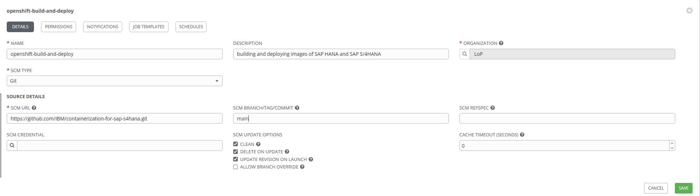

<!--
  ------------------------------------------------------------------------
  Copyright 2020 IBM Corp. All Rights Reserved.

  Licensed under the Apache License, Version 2.0 (the "License");
  you may not use this file except in compliance with the License.
  You may obtain a copy of the License at

      http://www.apache.org/licenses/LICENSE-2.0

  Unless required by applicable law or agreed to in writing, software
  distributed under the License is distributed on an "AS IS" BASIS,
  WITHOUT WARRANTIES OR CONDITIONS OF ANY KIND, either express or implied.
  See the License for the specific language governing permissions and
  limitations under the License.
 -------------------------------------------------------------------------->

# Building and deploying with Red Hat® Ansible® and Red Hat® Ansible Tower®

Build container images from existing SAP NetWeaver® and SAP S/4HANA®
systems and run them on a Red Hat® OpenShift® cluster on IBM Power
Systems.

## Contents

<details>
  <summary>Table of Contents</summary>

- [Important note](#important-note)
- [Building and deploying with Red Hat Ansible](#building-and-deploying-with-red-hat-ansible)
  - [Getting started with Red Hat Ansible](#getting-started-with-red-hat-ansible)
  - [Specifying your settings](#specifying-your-settings)
  - [Performing manual tasks before running the playbook](#performing-manual-tasks-before-running-the-playbook)
  - [Setting up the inventory for the playbook](#setting-up-the-inventory-for-the-playbook)
  - [Running the playbook](#running-the-playbook)
  - [Verifying successful deployment of the SAP system in the cluster](#verifying-successful-deployment-of-the-sap-system-in-the-cluster)
  - [Connecting to the SAP system](#connecting-to-the-sap-system)
  - [Recovering from errors](#recovering-from-errors)
- [Building and deploying with Red Hat Ansible Tower](#building-and-deploying-with-red-hat-ansible-tower)
  - [Getting started with Red Hat Ansible Tower](#getting-started-with-red-hat-ansible-tower)
  - [Performing manual tasks](#performing-manual-tasks)
  - [Creating a new project](#creating-a-new-project)
  - [Creating the inventory](#creating-the-inventory)
  - [Creating the job template](#creating-the-job-template)
  - [Building the images and starting the SAP system](#building-the-images-and-starting-the-sap-system)
  - [Connecting to the deployed SAP system](#connecting-to-the-deployed-sap-system)

</details>

Please refer also to this [IBM®
Redpaper](http://www.redbooks.ibm.com/Redbooks.nsf/RedpieceAbstracts/redp5619.html?Open)
for more information on how to setup the required environment.

## Important note

**This is a beta release and targets for test and other non-production
landscapes. The created deliverables are not supported by SAP nor
agreed to a roadmap for official support in current state (see also
SAP Note 1122387 - Linux: SAP Support in virtualized environments)**

## Building and deploying with Red Hat Ansible

### Getting started with Red Hat Ansible

To get started you need to set up your work environment and install
the Red Hat Ansible CLI. For detailed information on how to install
the Red Hat Ansible CLI refer to the [Red Hat Ansible installation
documentation](https://docs.ansible.com/ansible/latest/installation_guide/intro_installation.html).

Start by cloning this GitHub repository to your build machine:

```shell
  $ git clone https://github.com/IBM/containerization-for-sap-s4hana.git
```

Directory `ansible/` of your repository clone contains the following components for building images:

``` shell
  $ tree -L 1 ansible
  ansible
  ├── ...
  ├── ocp-deployment-ansible-tower.yml
  ├── ocp-deployment.yml
  ├── README.md
  ├── roles
  │   ├── build-images
  │   ├── copy-hdb-nfs
  │   ├── create-overlay-share
  │   ├── deploy-images
  │   ├── ocp-prerequisites
  │   ├── os-prerequisites
  │   └── push-images
  ├── tasks
  │   └── ...
  └── vars
      └── ocp-extra-vars.yml
```

The `roles/` directory contains Ansible roles that are reusable and
are included in the playbook `ocp-deployment.yml`. The following roles
are used to build images of your SAP HANA and SAP S/4HANA reference
system:

  + __os-prerequisites__ installs packages like *podman*,
    *git*, *python3*, *python3-devel*, *paramiko* and includes tasks
    for Red Hat RHEL 8.x as additional prerequisites. This role also
    verifies if the *oc* tool is installed and checks the connection
    to the NFS server. It generates the configuration file
    `config.yaml` and verifies if all input variables are valid.

  + __ocp-prerequisites__ creates a new project on the Red
    Hat OpenShift cluster, sets up permissions and generates the
    service-account.

  + __copy-hdb-nfs__ creates a snapshot copy of your SAP HANA
    `data/` and `log/` directories on the NFS server.

  + __build-images__ runs the process for building the
    *Init*, *SAP AppServer* and *SAP HANA* images.

The following roles are used to deploy the built images into the Red
Hat OpenShift cluster:

  + __push-images__ executes a task to push all images
    (`soos-init`, `soos-<nws4-sid>`, `soos-<hdb-sid>`) from the local
    registry to your Red Hat OpenShift cluster. Here, `<nws4-sid>` is
    the SAP system ID of your reference SAP NetWeaver or SAP S/4HANA
    system and `<hdb-sid>` is the SAP system ID of your reference
    database system.

  + __create-overlay-share__ creates an SAP HANA overlay
    share on the NFS server.

  + __deploy-images__ generates a deployment description file
    which describes the container setup and environment in the Red Hat
    OpenShift cluster and starts the deployment on the cluster.

### Specifying your settings

The file `vars/ocp-extra-vars.yml` in the `vars/` directory contains
all required variables that are used in the playbooks. Some variables
may contain sensitive information like IP addresses, passwords,
usernames. As an option you can use the Ansible Vault utility to
encrypt this sensitive content. See the [Red Hat Ansible
documentation](https://docs.ansible.com/ansible/latest/user_guide/vault.html)
for a details on how to set up Ansible Vault.

The file `vars/ocp-extra-vars.yml` looks as follows - replace all
placeholders of type `<parameter>` with your own settings:
```
---
######################
# build LPAR parameter
######################

# Path to the directory of the clone of this repository on the build LPAR
path_to_ocp_tool: <github_clone_dir>

# Directory under which the build contexts for image build are assembled
tmp_root: /data/tmp

# installs packages with ansible package module and state present
package_state: present

# generate config file for automatic tools script execution with template config.j2.template
template_config_file: config.j2.template


#####################################
# Red Hat OpenShift cluster parameter
#####################################

# Domain name of the Red Hat OpenShift Container Platform (OCP) cluster - used for "oc" operations
# The build LPAR must be able to connect to api.<ocp_cluster_domain>
ocp_cluster_domain: <ocp4-domain-name>

# Password of the kubeadmin user in the cluster
admin_psw: <kubeadmin-password>

# User in the Red Hat OpenShift cluster which is used for "oc" operations
oc_user: <ocp4-userid>

# Password of ocp_user in the Red Hat OpenShift cluster
oc_psw: <ocp4-user-password>

# Name of the project which will be created for the SAP workload (e.g. my-sap-project)
oc_project_name: <ocp4_project_name_for_SAP>


########################################
# SAP NetWeaver or SAP S/4HANA parameter
########################################

# Host on which the original SAP NetWeaver or SAP S/4HANA system is installed
# The SAP instance profile must also have this hostname in its name
host_nws4: <reference_system_hostname>

# User on host_nws4 which is used for ssh and rsync operations (needs root permissions)
host_user_nws4: root

# SAP system ID of the original SAP NetWeaver or SAP S/4HANA system (upper case)
nws4_sid: <AppServer_SID>

# SAP system ID of the original SAP NetWeaver or SAP S/4HANA system (lower case)
# Use lower case "sid" to generate deployment file name
nws4_sid_lower_case: <AppServer_sid_lower_case>

# SAP system ID of the original SAP HANA system (lower case)
# Use lower case "sid" to generate deployment file name
hdb_sid_deployment: <HANA_sid_lower_case>


###############
# NFS parameter
###############

# Host on which the NFS server is running
nfs_host: <NFS_server_hostname>

# User on nfs.host which is used for ssh and rsync operations (needs root permissions)
# Password-less access for this user from build LPAR to NFS server must be configured
nfs_user: root

# Path on nfs_host where directories {data,log} of the original SAP HANA system are copied to
path_to_hdb_copy: <NFS_server_export_dir_for_hdb>

# Path on nfs_host under which overlay file systems for container instances are created
path_to_overlay: <NFS_server_export_dir_for_overlay>
```

### Performing manual tasks before running the playbook

The following tasks are not automated and need to be performed
manually (find more details in section
["Prerequisites"](../README.md#prerequisites) of the main README
file):

  + Ensure that your file system on the build machine has at least 500
    GB capacity.

  + Create symbolic links to the directories under which the container
    images are  built.

  + Ensure that the required entries are added to the `/etc/hosts`file
    of your build machine.

  + Copy the public SSH key of the NFS server to your build machine:
    ```shell
    ssh-copy-id -i ~/.ssh/<nfs_rsa_key>.pub <user_name>@<build_machine_name>
    ```

### Setting up the inventory for the playbook

Before running the `ocp-deployment.yml` playbook, you need to set up
your inventory file on your build machine:

- Create a new file `ansible/hosts` in the `ansible/` directory of
  your repository clone and add the name of your build machine to the
  file.

- Create a new directory `ansible/host_vars/` in the `ansible/`
  directory

- Create a file `ansible/host_vars/<build-machine-name>.yml` where
  `<build-machine-name>` is the name of your build machine as specified
  in the `ansible/hosts` file.

- Add your remote user name and SSH key to
  `ansible/host_vars/<build-machine-name>.yml`:

  ```
  ---
  ansible_user: <username>
  ansible_ssh_private_key_file: ~/.ssh/<your_rsa_key>
  ```

### Running the playbook

To run the playbook execute

```shell
     $ cd ansible
     $ ansible-playbook -i hosts -e @vars/ocp-extra-vars.yml ocp-deployment.yml
```

The playbook

- installs all prerequisites,

- creates three container images `soos-init`, `soos-<nws4-sid>`,
  `soos-<hdb-sid>` which are stored in the local podman registry on
  your build machine and

- uses the roles `push-images`, `create-overlay-share`,
  `deploy-images` to push the container images into the cluster and
  start the deployment of the SAP system.

If the playbook run completed without errors, all three images were
successfully built and pushed into the local registry of your Red Hat
OpenShift cluster and the deployment of the SAP system was started on
the cluster.

### Verifying successful deployment of the SAP system in the cluster

Access to the SAP system from outside the cluster is enabled by a
cluster service of type NodePort. Verify whether the service was
correctly started by running

     $ oc get service/soos-<nws4-sid>-np

     NAME                 TYPE       CLUSTER-IP       EXTERNAL-IP   PORT(S)                              AGE
     soos-<nws4-sid>-np   NodePort   172.30.187.181   <none>        32<nws4-di-instno>:<node-port>/TCP   9m9s

To verify if SAP HANA and SAP S/4 HANA are running in the cluster use
this command:

```shell
    $ oc describe pod soos-<nws4-sid>
```

For more information on verifying the successful deployment of the SAP
system in the cluster see section [Verifying the correct start of the
SAP
system](../README.md#verifying-the-correct-start-of-the-sap-system) of
the main README file.

### Connecting to the SAP system

Section [Connecting to the SAP
system](../README.md#connecting-to-the-sap-system) of the main README
file describes how to connect to the SAP system.

### Recovering from errors

In case of playbook execution failure a you can delete your deployment
from the cluster, using the implemented task in
`tasks/stop-deployment.yml`. Include this task with `import_tasks` in
your playbook and run it.

To remove one or more of the previously created images from the local
podman repository on your build machine, list the images by running

``` shell
$ podman images

```

copy the image ID and remove the image by issuing:

``` shell
$ podman rmi -f <image-id>
```

## Building and deploying with Red Hat Ansible Tower

### Getting started with Red Hat Ansible Tower

In the following we assume that you have installed and configured Red
Hat Ansible Tower on your build machine.

The basic installation of Ansible Tower is described in the [Ansible
Automation Platform Quick Installation
Guide](https://docs.ansible.com/ansible-tower/latest/html/quickinstall/index.html).

More detailed information is available in the [Ansible Automation
Platform Installation and Reference
Guide](https://docs.ansible.com/ansible-tower/3.8.0/html/installandreference/index.html#ir-start).

### Performing manual tasks

The tasks that need to be performed manually are described in section
[Performing manual tasks before running the
playbook](#performing-manual-tasks-before-running-the-playbook).

### Creating a new project

You need to set up a project that will be used in a job template for
building and deploying images.

To define a new project, log into the Red Hat Ansible Tower web
interface using admin-level credentials. Select *Projects* in the left
navigation bar and click a green plus-button in the right top
corner. You will get a new project view in which you need to fill in
all required fields:

   + Define a project name.
   + Add a description.
   + Select organization - as an example `Default` can be used.
   + Select `Git` as __SCM TYPE__.
   + Specify __SCM BRANCH/TAG/COMMIT__ to checkout source code, as example `master` can be defined.
   + Select __SCM UPDATE OPTIONS__ check boxes such as `clean`, `delete on update` and `update revision on launch`.

You do not need credentials to access our GitHub repository since the
provided URL is public - just copy it into the field __SCM URL__ of the
*Projects* template as shown:

__SCM URL__: `https://github.com/IBM/containerization-for-sap-s4hana.git`



### Creating the inventory

Before creating a job template you need to set up your inventory
defining the build host and credentials. Refer to chapter
[Inventories](https://docs.ansible.com/ansible-tower/latest/html/userguide/inventories.html)
of the *Ansible Tower User Guide* for detailed instructions.

### Creating the job template

Next, select *Templates* on the left side of the navigation panel. You
will see a list of job templates, if there are any. To define a new
job template click the green plus on the top right corner as shown:


Fill in all required fields and the desired optional fields. Detailed
explanations about job templates are described in chapter [Job
Templates](https://docs.ansible.com/ansible-tower/latest/html/userguide/job_templates.html)
of the *Ansible Tower User Guide*.

Add your variables as specified in file `vars/ocp-extra-vars.yml` to
field __Extra Variables__. See section [Specifying your
settings](#specifying-your-settings) for all required variables.

Select playbook `ansible/ocp-deployment-ansible-tower.yml` in field __Playbook__.

Finally save the job template.

### Building the images and starting the SAP system

Launch the job. A green status of the job run indicates that the three
images were successfully built and the deployment of the SAP system
was successfully started.

Verify whether your SAP system was correctly started by performing the
steps described in section [Verifying the correct start of the
SAP
system](../README.md#verifying-the-correct-start-of-the-sap-system)
of the main README file.

### Connecting to the deployed SAP system

To connect to the deployed SAP system refer to section [Connecting to
the SAP system](../README.md#connecting-to-the-sap-system) of the main
README file.
