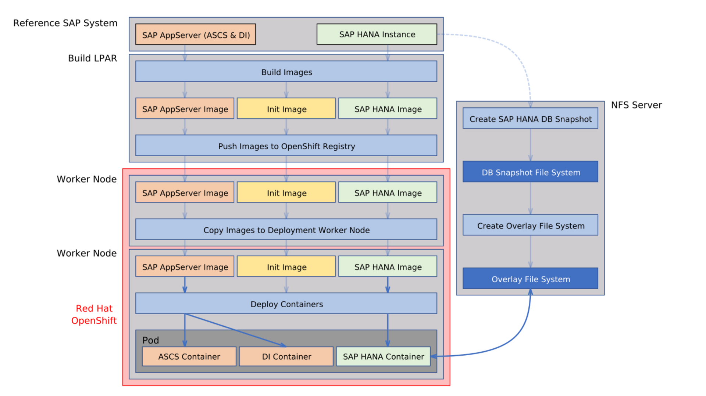

<!--
  ------------------------------------------------------------------------
  Copyright 2021 IBM Corp. All Rights Reserved.

  Licensed under the Apache License, Version 2.0 (the "License");
  you may not use this file except in compliance with the License.
  You may obtain a copy of the License at

      http://www.apache.org/licenses/LICENSE-2.0

  Unless required by applicable law or agreed to in writing, software
  distributed under the License is distributed on an "AS IS" BASIS,
  WITHOUT WARRANTIES OR CONDITIONS OF ANY KIND, either express or implied.
  See the License for the specific language governing permissions and
  limitations under the License.
 -------------------------------------------------------------------------->

# Architecture

The following describes the general architecture of how to build
container images from existing reference SAP® systems and deploying
containers in a Red Hat® OpenShift® Container Platform.

## Contents

  
Table of Contents

- [General Architecture and Workflow](#general-architecture-and-workflow)

## General Architecture and Workflow

The following picture describes the steps that are executed during
image build and container deployment:

During the build phase three different images are created:

- *Init* image: This image is independent from the reference SAP system
  and is used during the initialization of the deployment in the
  cluster.

- *SAP AppServer* image: This image contains all relevant components
  of the reference SAP system that are needed to start both the *ABAP SAP Central Services* (ASCS) 
  and the *Dialog instance* (DI) containers.

- *SAP HANA* image: This image contains the SAP HANA® instance
  directories. It does not contain the `data/` and the `log/`
  directory trees of the database. A snapshot of these two directory
  trees is copied to the NFS file server during the build phase. At
  deployment time an overlay file system is created on top of the
  snapshot and mounted into the SAP HANA container.

The images are pushed into the internal cluster registry. At
deployment time the images are copied to the cluster helper node on
which the deployment is started. At deployment start the *init*
container sets up the environments for the application containers
(ASCS, DI and SAP HANA containers). These are started after the *init*
container has terminated. During start up of the SAP HANA container the
overlay file system is mounted into the container.

