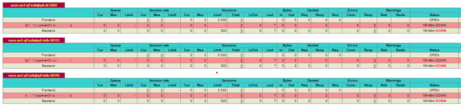

<!--
  ------------------------------------------------------------------------
  Copyright 2022 IBM Corp. All Rights Reserved.

  Licensed under the Apache License, Version 2.0 (the "License");
  you may not use this file except in compliance with the License.
  You may obtain a copy of the License at

      http://www.apache.org/licenses/LICENSE-2.0

  Unless required by applicable law or agreed to in writing, software
  distributed under the License is distributed on an "AS IS" BASIS,
  WITHOUT WARRANTIES OR CONDITIONS OF ANY KIND, either express or implied.
  See the License for the specific language governing permissions and
  limitations under the License.
 -------------------------------------------------------------------------->

# Cleaning up the Environment

In the following we describe which objects are created during the image build 
process on the build system, the NFS Server and in the Red 
Hat® OpenShift® Container Platform and how they can be removed. 

<!-- TOC-START -->

## Contents

<details>
  <summary>Table of Contents</summary>

- [Cleaning up the Build LPAR](#cleaning-up-the-build-lpar)
  - [Cleaning up the Temporary Image Build Files](#cleaning-up-the-temporary-image-build-files)
  - [Cleaning up the Local Image Repository](#cleaning-up-the-local-image-repository)
- [Cleaning up the NFS Server](#cleaning-up-the-nfs-server)
  - [Cleaning up Orphaned Overlay Filesystems](#cleaning-up-orphaned-overlay-filesystems)
  - [Cleaning up the base directory](#cleaning-up-the-base-directory)
- [Cleaning up the Red Hat OpenShift Container Platform](#cleaning-up-the-red-hat-openshift-container-platform)
  - [Deleting Unnecessary OC Projects](#deleting-unnecessary-oc-projects)
  - [Deleting Old Images from OCP Cluster Registry](#deleting-old-images-from-ocp-cluster-registry)
- [Cleaning up the Red Had OpenShift Container Platform Helper Node](#cleaning-up-the-red-had-openshift-container-platform-helper-node)
  - [Deleting orphaned entries in the HAProxy configuration](#deleting-orphaned-entries-in-the-haproxy-configuration)

</details>

<!-- TOC-END -->

## Cleaning up the Build LPAR

### Cleaning up the Temporary Image Build Files

During the image build [`tools/image-build`](./TOOLS.md#tool-image-build) temporary files are copied from the 
reference SAP system hosts to the build system. These temporary files are stored in directory `<temp-root>`.
If you do not explicitly specify a temporary directory as argument when building the images, `/data/tmp` is used.

It may be required to clean up temporary build data  

`rm -rf /data/tmp/soos-build-<flavor>.<temp-uuid>*`

### Cleaning up the Local Image Repository

To remove one or more of the previously created images from the local
`podman` repository on your build LPAR:

- list the images by running

``` shell
  # podman images
```

- copy the image ID and remove the image by issuing:

``` shell
  # podman rmi -f <image-id>
```

## Cleaning up the NFS Server

### Cleaning up Orphaned Overlay Filesystems

**These tasks are normally executed out of [`tools/ocp-deployment --remove`](TOOLS.md#tool-ocp-deployment) or [`tools/nfs-overlay-teardown`](TOOLS.md#tool-nfs-overlay-teardown)**

:warning: Before any manual clean up action on the NFS server ensure that the deployment in scope is stopped - so that the direcories are not mounted any more via NFS in a pod.

- Edit the NFS export list `/etc/exports` on the NFS server and remove all orphaned exported filesystems

- execute `exportfs -a`  as `root` user on the NFS server to stop exporting

- unmount all unnecessary overlay filesystems

- Edit `/etc/fstab` on the NFS server and remove all the unneccesary overlay filesystems


### Cleaning up the base directory

Once all deployments are deleted and there is no intention to reactivate them once again then the initial copy of `{data,log}` for the SAP HANA system can be removed too.

Before this action see [Cleaning up the Orphaned Overlay Filesystems](#cleaning-up-orphaned-overlay-filesystems) to ensure that no overlay filesystems is present any more.

Identify the base directory `nfs.bases.copy` in the config file `config.yaml`

Example:

```shell
bases:
    description: Base directories
    copy:
      description: Path where directories {data,log} of the original
                   SAP HANA system are copied to
      required: true
      value: '/nfsexp/soos/data'
```

and remove the SAP HANA data in it.

## Cleaning up the Red Hat OpenShift Container Platform

### Deleting Unnecessary OC Projects

- Login as OC cluster user, e.g. by running

  `tools/oc-login -u`


   on the build LPAR.

- Delete the project 

  `oc delete project <ocp-project-name>` 

   This will delete the project with all objects in it.

### Deleting Old Images from OCP Cluster Registry

Cluster administrators can periodically prune older versions of images that are no longer in use, but are still taking up disk space.

- Login as OC cluster admin, e.g. by running

  `tools/oc-login -a`


  on the build LPAR.

- Execute the image pruning via 

  `oc adm prune images --confirm --registry-url=https://default-route-openshift-image-registry.apps.<ocp-domain-name>`

## Cleaning up the Red Had OpenShift Container Platform Helper Node

### Deleting orphaned entries in the HAProxy configuration

Check the connections using the web monitor for HAProxy. On the Red Had OpenShift Container
Platform helper node the web monitor can be reached via a browser using 
`http://<ocp-helper-node>:9000`   

If all connections of one deployment `<app-name>` are down, the deployment is probably stopped
or even removed. 



- As long as the deployment `<app-name>` is not removed from the RedHat OpenShift Cluster, the HAProxy entries of it can be removed by executing 

   `tools/ocp-haproxy-forwarding --remove --app-name=<app-name>` 
  
  on the build LPAR.

- If the deployment `<app-name>` is already removed from the RedHat OpenShift Cluster, then
  the it cannot be removed from the HAProxy configuration using the tools.

  Logon as user `root` to the Red Had OpenShift Container Platform helper node, and 
  - remove the orphaned entries by editing 
    `/etc/haproxy/haproxy.cfg`
  
  - Afterwards reload the HAProxy service

    `systemctl reload haproxy`
