<!--
  ------------------------------------------------------------------------
  Copyright 2021 IBM Corp. All Rights Reserved.

  Licensed under the Apache License, Version 2.0 (the "License");
  you may not use this file except in compliance with the License.
  You may obtain a copy of the License at

      http://www.apache.org/licenses/LICENSE-2.0

  Unless required by applicable law or agreed to in writing, software
  distributed under the License is distributed on an "AS IS" BASIS,
  WITHOUT WARRANTIES OR CONDITIONS OF ANY KIND, either express or implied.
  See the License for the specific language governing permissions and
  limitations under the License.
 -------------------------------------------------------------------------->
# How To

This document contains detailed instructions on how to perform
specific tasks in the context of containerization of SAP® systems.

<!-- TOC-START -->

## Contents

<details>
  <summary>Table of Contents</summary>

- [Connecting to the SAP® S/4HANA® Database using SAP HANA Studio®](#connecting-to-the-sap-s4hana-database-using-sap-hana-studio)
  - [Connecting to the System Database with SAP HANA Studio](#connecting-to-the-system-database-with-sap-hana-studio)
  - [Adapting the SAP HANA Configuration](#adapting-the-sap-hana-configuration)
  - [Connecting to the Tenant Database with SAP HANA Studio](#connecting-to-the-tenant-database-with-sap-hana-studio)

</details>

<!-- TOC-END -->

## Connecting to the SAP® S/4HANA® Database using SAP HANA Studio®

Start *tools/ocp-port-forwarding* on the build LPAR. 

Once started, the connection details for SAP HANA Studio will be shown:

```shell
Use the following parameters to create an SAP HANA Studio connection:
----------------------------------------
   Host Name           <hostname>
   Instance Number     <inst-no>
   System ID           <hdb-sid>

To connect to the tenant DB with SAP HANA Studio it is required
to set a new entry in the SAP HANA DB parameter global.ini file
In section public_hostname_resolution:
    - Ensure Key: use_default_route has value  ip (default)
    - Add    Key: map_<hostname>    with value <IP address>
Use scope System for the parameter change
----------------------------------------
```
### Connecting to the System Database with SAP HANA Studio

When the SAP HANA database is up and running in the container, and port forwarding is established by *tools/ocp-port-forwarding*, then the system database can be registered in SAP HANA Studio.

Launch **SAP HANA Studio**, and select **Add System**:

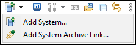

Enter the SAP HANA connection parameters (**Host Name**, effective **Instance Number**) as listed by *tools/ocp-port-forwarding*

Select checkboxes “**Multiple Containers**” and  “**System database**”, then enter a **Description** of your choice:

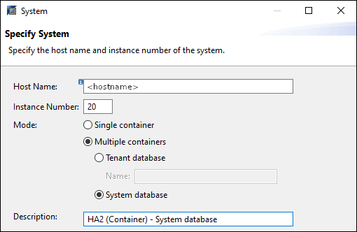

choose **Next**.

Register the SAP system database using an **User Name** having the desired privileges. Create an appropriate technical user with privileges according to the role (backup, monitoring, managing roles and users, … ) in the database before. 

In the example, the SYSTEM user is used.

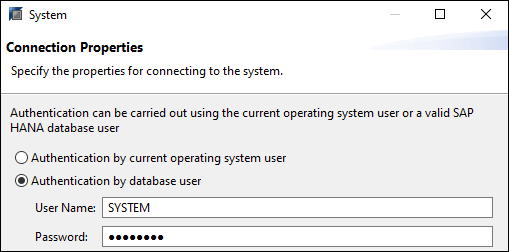

Afterwards, press **Finish** to start the registration. 

If registration is successful and communication to the pod is possible, the SYSTEMDB will appear in the menu with a “green” state:

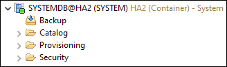

### Adapting the SAP HANA Configuration
Hostname and IP address used within the pod are not visible outside the OpenShift Container Platform. The entry point for SAP HANA Studio is different to the pod, so communication settings need to be adjusted in the SAP HANA configuration.
 
In SAP HANA Studio, open the **Administration Tab** for the System DB, Select Tab **Configuration**, and search for parameter *public_hostname_resolution* in global.ini:

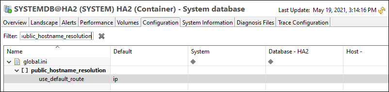

There should be only one entry with name *use_default_route* and default value *ip*. 

Add a second entry within the *public_hostname_resolution* section.  Right click, and select **Add parameter**

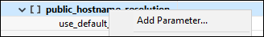

Select the *System wide* **Scope**:

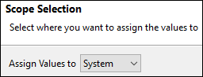

For key enter *map_\<hostname\>* and for value the *IP address* of the system hosting the SSH tunnels as reported from *tools/ocp-port-forwarding*

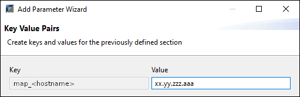

Afterwards, press **Finish**.

Once done, the tenant DB can be registered in SAP HANA Studio.

### Connecting to the Tenant Database with SAP HANA Studio

Open SAP HANA Studio, and select **Add System**:


Enter the SAP HANA connection parameters as listed from *tools/ocp-port-forwarding* (**Host Name**, effective **Instance Number**). 

Select Mode “**Multiple Containers**” and checkmark “**Tenant database**”, enter the **SID** of the tenant, 
and a **Description** of your choice:

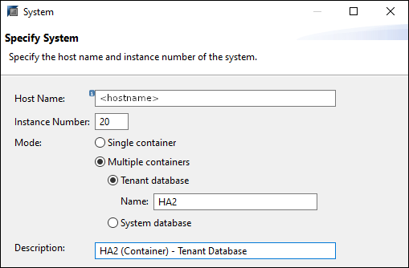

choose **Next**.

Register with a User Name with sufficient privileges. 
You can use the ABAP connect user at first, or create an appropriate technical user with limited privileges according to the purpose (backup, monitoring, managing roles and users, … )

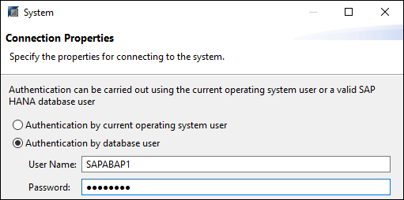

Afterwards, press **Finish**

As result, both the system database and the tenant database should get visible in the menu in status green:

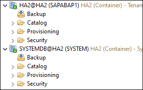
