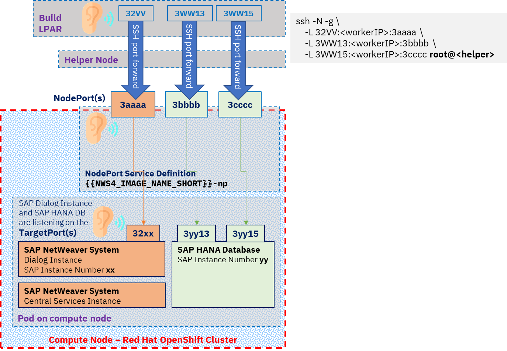
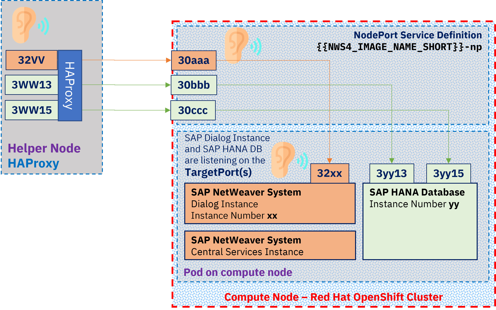

<!--
  ------------------------------------------------------------------------
  Copyright 2021, 2022 IBM Corp. All Rights Reserved.

  Licensed under the Apache License, Version 2.0 (the "License");
  you may not use this file except in compliance with the License.
  You may obtain a copy of the License at

      http://www.apache.org/licenses/LICENSE-2.0

  Unless required by applicable law or agreed to in writing, software
  distributed under the License is distributed on an "AS IS" BASIS,
  WITHOUT WARRANTIES OR CONDITIONS OF ANY KIND, either express or implied.
  See the License for the specific language governing permissions and
  limitations under the License.
 -------------------------------------------------------------------------->

# Introducing Options for End-User GUI Access to the Containerized Systems

In the following we describe how to access a containerized copy of your reference SAP® system using the graphical user interface.

<!-- TOC-START -->

## Contents

<details>
  <summary>Table of Contents</summary>

- [Exposing the SAP Dialog Instance and SAP HANA Database via NodePorts](#exposing-the-sap-dialog-instance-and-sap-hana-database-via-nodeports)
- [Role of the SAP Instance Number](#role-of-the-sap-instance-number)
- [Exposing the Ports as NodePorts](#exposing-the-ports-as-nodeports)
- [Translating the NodePort to the SAP Client Rule](#translating-the-nodeport-to-the-sap-client-rule)
- [Considerations for Multiple Deployments of one SAP System](#considerations-for-multiple-deployments-of-one-sap-system)
  - [Establishing an SSH Tunnel on the build LPAR](#establishing-an-ssh-tunnel-on-the-build-lpar)
  - [Levering the HAProxy Service on the Helper Node](#levering-the-haproxy-service-on-the-helper-node)

</details>

<!-- TOC-END -->

## Exposing the SAP Dialog Instance and SAP HANA Database via NodePorts

A NodePort service provides an entry point for incoming network requests. The assigned NodePort
gets exposed on the worker node (*kubeproxy* settings): A port listening for requests to the service is established. External communication needs to be addressed to the public IP address of the worker node serving the service and the NodePort (\<IP_address>:\<nodeport>). The packets are forwarded then to the SAP Dialog Instance or the SAP HANA Database in the pod.

Following specs are specified for the NodePort service

| Spec      | Description                                                                                       |
|:----------|:--------------------------------------------------------------------------------------------------|
|name       |Name of the NodePort                                                                               |
|port       |Expose the service on this port internally in the Red Hat OpenShift cluster                        |
|targetPort |Port in the pod to which the request gets sent to. The containerized app is listening on this port.|
|nodePort   |Makes the service visible outside the Red Hat OpenShift cluster. OpenShift will assign and allocate a NodePort. NodeParts are in range 30000 - 32767 by default.|

## Role of the SAP Instance Number

GUIs like SAPGUI, SAP HANA Studio or SAP HANA Cockpit do not allow to configure
a communication out of the NodePort port range directly. SAP has the concept of an
**SAP Instance Number**: the communication port is derived via this SAP Instance number.

The SAP Help Portal includes a detailed list of the
[TCP/IP Ports of All SAP Products](https://help.sap.com/viewer/ports).
Following ports for client access are exposed as NodePort by default when
the containers of the SAP system get deployed to the Red Hat OpenShift cluster:  

| Container             | Port Name      | Range        |Rule    |   | Access                                   |
|:----------------------|:---------------|:-------------|:-------|:-:|:---------------------------------------- |
|Dialog Instance (di)   |SAP Dispatcher  |3200 - 3299   |32\<NN> |   |SAP GUI for Windows and Java.             |
|SAP HANA Database (hdb)|indexserver     |30013 - 39913 |3\<NN>13|   |Access port for the System database.      |
|SAP HANA Database (hdb)|indexserver     |30015 - 39915 |3\<NN>15|:one:|Access port for the first tenant database.|

while **\<NN>** reflects the **SAP Instance Number** of the instance.

**Notes**

:one: Port `3<NN>15` is assumed as SQL/MDX port for the tenant database.
In case another port, e.g. port `3<NN>41`, is configured for the tenant database,
then the connection setup neds to be adjusted.
See also [Enabling Additional Connections to the SAP System](VERIFYING-MANAGING.md#enabling-additional-connections-to-the-sap-system).

## Exposing the Ports as NodePorts

Template of the NodePort definition file for container access:

```shell
spec:
  type: NodePort
  ports:
  - name: di-32xx
    port: 32{{NWS4_DI_INSTNO}}
    targetPort: 32{{NWS4_DI_INSTNO}}
    protocol: TCP
  - name: hdb-3xx13
    port: 3{{HDB_INSTNO}}13
    targetPort: 3{{HDB_INSTNO}}13
    protocol: TCP
  - name: hdb-3xx15
    port: 3{{HDB_INSTNO}}15
    targetPort: 3{{HDB_INSTNO}}15
    protocol: TCP
  selector:
    app:  {{NWS4_IMAGE_NAME_SHORT}}
```

where:
| Parameter            | Description          |
|:---------------------|:---------------------|
| `{{NWS4_DI_INSTNO}}` | SAP Instance Number of Dialog Instance |
| `{{HDB_INSTNO}}` | SAP Instance Number of SAP HANA Database |
| `{{NWS4_IMAGE_NAME_SHORT}}` | Name of Deployment/ AppName in Red Hat OpenShift cluster|


Those specs will be applied for the NodePort service during the deployment.
The three ports listed above get exposed per default.

It is possible to expose additional ports: 
See [Enabling Additional Connections to the SAP System](./VERIFYING-MANAGING.md#enabling-additional-connections-to-the-sap-system)

## Translating the NodePort to the SAP Client Rule

Client access from outside the Red Hat OpenShift Container Platform to the containers in the pod is possible via the NodePort.

SAP GUI, SAP HANA Studio, and SAP Cockpit port ranges are beyond the default NodePort port range (30000 - 32767), and the end user clients might have restricted access to the external Red Hat OpenShift cluster network.

Options to enable connectivity for end user
GUI access to the SAP System running in the Red Hat OpenShift
cluster include: 

- Establish an SSH tunnel on the build LPAR

  Use SSH forward via the helper node to the NodePort on the pod on which the SAP system is running.

- Leverage the HAProxy service on the helper node

  HAProxy service acts as common entry point on the helper node.
  HAProxy forwards to the NodePort on the pod on which the SAP system is running

Two tools are available to enable connectivity for end user
GUI access cluster via the methods.

See [Preparing Connections to the SAP System](./VERIFYING-MANAGING.md#preparing-connections-to-the-sap-system)

## Considerations for Multiple Deployments of one SAP System

In case that the containerized SAP system is deployed multiple times
in your Red Hat OpenShift Container Platform in one user project,
then the specific **appName** of the deployment needs to be specified
as argument `--app-name` in the forwarding commands.

To identify the **appName** in scope execute the tool

```shell
tools/ocp-deployment --list
Logging to './log/ocp-deployment-16468460088775728.log'
Status  App-Name              OverlayUuid
====================================================================
Running soos-<sid>-il82e43b2u <ocp-user>-<ocp project>-<identifier>
```

on the build LPAR. The current deployments and their state are listed
in the output of the command. In case multiple **appNames** are reported,
select the appropriate one as argument for the forwarding commands.

### Establishing an SSH Tunnel on the build LPAR

Establish a port forwarding tunnel to the SAP system by starting

```shell
tools/ocp-port-forwarding
```

on the build LPAR.

In case of multiple deployments, it is required to identify the deployment by specifying the application name
or a unique part of it:

```shell
tools/ocp-port-forwarding --app-name il82e43b2u
```

The tool analyzes the NodePort service settings, and establishes SSH tunnels via the helper node to the pod on which the SAP system is running. The endpoint for the communication is created on the build LPAR: As long as the required tcp ports are not in use on the build LPAR, the port number and so the SAP instance number is preserved. Otherwise an "effective" SAP Instance number will be incremented until a free port in the port range is found - this "effective" SAP Instance number needs to be entered when defining the properties for the SAP GUI, SAP HANA Studio, or SAP HANA cockpit connection.

Communication will be forwarded to the NodePort at first, and finally be sent to the listening socket in the pod.



### Levering the HAProxy Service on the Helper Node
HAProxy is a fast and reliable reverse-proxy offering high availability, 
load balancing, and proxying for TCP and HTTP-based applications. 

The tool levers the default HAProxy installation running on the Red Hat OpenShift 
Container Platform helper node as common endpoint. HAProxy is used to forward 
SAPGUI or SAP HANA SQL/MDX communication to the NodePorts in the Pod.

To configure the HAProxy service running on the helper node execute

```shell
tools/ocp-haproxy-forwarding --add
```

on the build LPAR.

In case of multiple deployments, it is required to identify the deployment by specifying the application name
or a unique part of it:

```shell
tools/ocp-haproxy-forwarding --add --app-name il82e43b2u
```

The tool analyzes the NodePort service settings, and adds the external IP address of the compute node where the SAP system is running, as well as the NodePort to the HAProxy configuration.

HAProxy binds to a listening socket on the helper node: As long as the required tcp ports are not in use on the helper node, the port number and so the SAP instance number is preserved. Otherwise an "effective" SAP Instance number will be incremented until a free port in the port range is found - this "effective" SAP Instance number needs to be entered when defining the properties for the SAP GUI, SAP HANA Studio, or SAP HANA cockpit connection. 



To list the status and get the connection details execute
 
```shell
tools/ocp-haproxy-forwarding --list
```

To remove a system from the HAProxy configuration on the helper node execute
 
```shell
tools/ocp-haproxy-forwarding --remove
```

