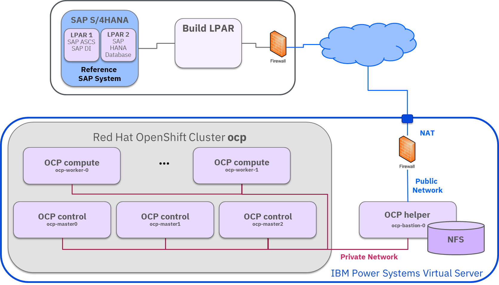
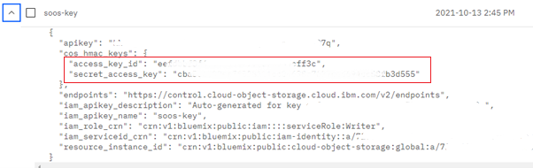
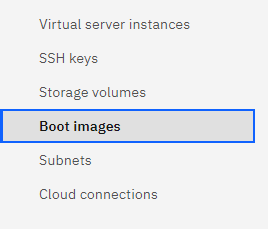
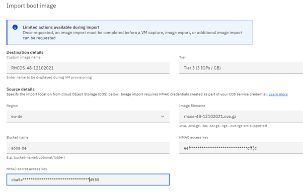
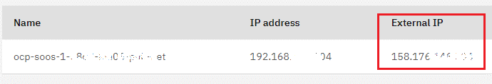

<!--
  ------------------------------------------------------------------------
  Copyright 2022 IBM Corp. All Rights Reserved.

  Licensed under the Apache License, Version 2.0 (the "License");
  you may not use this file except in compliance with the License.
  You may obtain a copy of the License at

      http://www.apache.org/licenses/LICENSE-2.0

  Unless required by applicable law or agreed to in writing, software
  distributed under the License is distributed on an "AS IS" BASIS,
  WITHOUT WARRANTIES OR CONDITIONS OF ANY KIND, either express or implied.
  See the License for the specific language governing permissions and
  limitations under the License.
 -------------------------------------------------------------------------->

# Containerization for SAP S/4HANA with Red Hat OpenShift Container Platform on IBM Power Systems Virtual Server

The solution allows to build container images of existing SAP® NetWeaver® and SAP® S/4HANA® systems deployed on Linux®. 
These containers are then executed on a Red Hat® OpenShift® Container Platform.

The Red Hat OpenShift Container Platform can be deployed either "on-premise" close to the reference SAP systems, 
or can be deployed using IBM Power® Systems Virtual Server.

<!-- TOC-START -->

## Contents

<details>
  <summary>Table of Contents</summary>

- [Scenario Overview](#scenario-overview)
- [Deploying Red Hat OpenShift Container Platform on IBM Power Systems Virtual Server](#deploying-red-hat-openshift-container-platform-on-ibm-power-systems-virtual-server)
  - [Preparing IBM Power Systems Virtual Server for Red Hat OpenShift Container Platform](#preparing-ibm-power-systems-virtual-server-for-red-hat-openshift-container-platform)
  - [Creating OVA images for Red Hat OpenShift Container Platform on IBM Power Systems Virtual Server](#creating-ova-images-for-red-hat-openshift-container-platform-on-ibm-power-systems-virtual-server)
    - [Preparing the Build LPAR for Image Conversion](#preparing-the-build-lpar-for-image-conversion)
    - [Downloading and Converting the RHCOS Image](#downloading-and-converting-the-rhcos-image)
    - [Copying the image to the Cloud Object Storage](#copying-the-image-to-the-cloud-object-storage)
    - [Importing the Image into IBM Power Systems Virtual Server](#importing-the-image-into-ibm-power-systems-virtual-server)
  - [Installing Red Hat OpenShift Container Platform on IBM Power Systems Virtual Server](#installing-red-hat-openshift-container-platform-on-ibm-power-systems-virtual-server)
  - [Configuring Connectivity to Power Systems Virtual Server](#configuring-connectivity-to-power-systems-virtual-server)
- [Executing SAP Container Deployment to Red Hat OpenShift Container Platform on IBM Power Systems Virtual Server](#executing-sap-container-deployment-to-red-hat-openshift-container-platform-on-ibm-power-systems-virtual-server)

</details>

<!-- TOC-END -->
## Scenario Overview

The picture below illustrates the scenario having the Red Hat OpenShift Container Platform 
deployed with IBM Power Systems Virtual Server:



The Build LPAR needs to communicate with

- the Reference SAP system via the "on-premise" network

- the Red Hat OpenShift Container Platform helper node. This helper node has a network address 
on a public network in IBM Power Systems Virtual Server. The internal IP address is not reachable 
directly from outside, but via Network Address Translation (**NAT**)

## Deploying Red Hat OpenShift Container Platform on IBM Power Systems Virtual Server

The tutorial 
[Deploying Red Hat OpenShift Container Platform 4.x on IBM Power Systems Virtual Server](https://developer.ibm.com/components/ibm-power/series/deploy-ocp-cloud-paks-power-virtual-server/) 
describes all necessary steps how to setup the Red Hat OpenShift Container Platform 
on IBM Power Systems Virtual Server.

To deploy and run containers based on the images for running SAP systems in a 
Red Hat Openshift Container Platform on IBM Power Systems Virtual Server 
only a few specific adaptions are required. 

### Preparing IBM Power Systems Virtual Server for Red Hat OpenShift Container Platform

An IBM Cloud® account is required to be able to create the IBM Power Systems Virtual Server service. 
In case you do not have an IBM Cloud account, register on 
[Create an IBM Cloud account](https://cloud.ibm.com/registration) first.
*Registration to IBM Cloud is complimentary, but costs will occur once you deploy 
IBM Power Systems Virtual Server services and instances*

Follow all the steps as described in 
[Setting up IBM Power Systems Virtual Server for Red Hat OpenShift Container Platform](https://developer.ibm.com/learningpaths/getting-started-openshift-powervs/setting-up-powervs-for-ocp/):

- An IBM Power Systems Virtual Server service needs to be created first.
- A private network subnet for internal Red Hat Open Shift Container Platform communication 
needs to be created in the IBM Power Systems Virtual Server service.
- Communication on the new private network subnet is disabled by default. 
A request for enabling network communication via that network needs to be raised:

  - Request enabling the communication via the private network by opening a 
[support ticket](https://cloud.ibm.com/docs/power-iaas?topic=power-iaas-getting-help-and-support) in case the private network is used solely for communication of instances belonging to the IBM Power Systems Virtual Server  service.

  - In case that network communication is required to other instances in IBM Cloud or if further IBM Cloud network services are used then the enabling request is part of the **IBM Cloud Direct Link configuration**.

Once the general preparation steps are done, the operating system images need to be prepared.

### Creating OVA images for Red Hat OpenShift Container Platform on IBM Power Systems Virtual Server

Two different operating system images are required for the Red Hat OpenShift Container Plattform cluster:

- Red Hat Enterprise Linux (RHEL) image

  This image is used for installing the helper node (aka bastion node)

- Red Hat Enterprise Linux CoreOS (RHCOS) image

  This image is used on all OpenShift cluster nodes

At the moment, these images are *not available as default images* in the image catalog of IBM Power Systems Virtual Server. The two image flavors need to be created first and uploaded as *custom images*.

In case you have these images already available in an on-premise IBM Power System environment managed by IBM PowerVC, then you can export an image to an OVA package: See [Export an image to an OVA package](https://www.ibm.com/docs/en/powervc/2.0.2?topic=SSXK2N_2.0.2/com.ibm.powervc.standard.help.doc/powervc_export_image_hmc.html) in your PowerVC documentation. Then [Copy the image to the Cloud Object Storage](#copying-the-image-to-the-cloud-object-storage) Storage and [import it into the IBM Power Systems Virtual Server service](#importing-the-image-into-ibm-power-systems-virtual-server) as shown below.

In the example below, version Red Hat OpenShift V4.9 was installed in IBM Power Systems Virtual Server. So operating system RHEL 8.4 was chosen for the helper node, and RHCOS 4.9.0 was chosen for all the OpenShift cluster nodes. Those images need to be created and uploaded to the service in IBM Power Systems Virtual Server.

For uploading images to IBM Power Systems Virtual Server an **IBM Cloud Object Storage** bucket is required. The bucket need to be located in a specific region: Ensure that the COS bucket is located in one of the regions out of _us-east_, _us-south_, _eu-de_, _eu-gb_, _au-syd_, _jp-tok_, _jp-osa_, _ca-tor_

This section shows the details for creating an OVA formatted image for RHCOS, and how to upload this to IBM Cloud Object Storage. You can then import the images to the boot images in the IBM Power Systems Virtual Server service. The image disk should have a minimum size of 120 GB. See also [Create and upload OVA files as boot images for RHEL and RHCOS](https://developer.ibm.com/learningpaths/getting-started-openshift-powervs/preparing-ova-for-openshift-on-cloud/)

All the steps for the image preparation are executed on the **build LPAR**.

Creating the OVA image for the RHEL boot image follows the same approach, however the RHEL image needs to be loaded from a different location (according to your RHEL subscription).

#### Preparing the Build LPAR for Image Conversion

- Login as `root` and install packages **cloud-utils-growpart** and **qemu-img**

  ```bash
  # dnf install -y qemu-img cloud-utils-growpart
  ```

- Download the **pvsadm** tool

  ```bash
  # curl -sL https://github.com/ppc64le/cloud/pvsadm/releases/download/v0.1/pvsadm-linux-ppc64le -o /usr/local/bin/pvsadm
  
  # chmod +x /usr/local/bin/pvsadm
  ```

- Download and Configure AWS CLI

   The official command-line interface for AWS is compatible with the IBM® Cloud Object Storage S3 API. AWS CLI can be installed from the Python Package Index via pip install awscli.

   ```bash
   # pip install awscli
   ```

  Afterwards, configure AWS CLI using the credential parameters of your Cloud Object Storage.

  For the configuration, you need **access\_key\_id** and **secret\_access\_key** as shown in the **Service Credentials** View for the Cloud Object Storage on IBM Cloud:
  
  

  Enter those parameters, and the region name during aws cli configuration:

  ```bash
  # aws configure
  AWS Access Key ID [None]:ee****************ff3c
  AWS Secret Access Key [None]:cb****************b3d555
  Default region name [None]: eu-de
  Default output format [None]: json
  ```

  Now you should be able to access the COS content:

  ```bash
   # aws --endpoint-url https://s3.eu-de.cloud-object-storage.appdomain.cloud s3 ls
    ...
    2021-10-13 14:44:43 soos
    2021-10-18 18:04:56 soos-de
    ... 
  ```

#### Downloading and Converting the RHCOS Image

- Download the RHCOS image (in Qcow2 format) from Red Hat

  The image can be downloaded via the OpenShift software repository for IBM Power: [https://mirror.openshift.com/pub/openshift-v4/ppc64le](https://mirror.openshift.com/pub/openshift-v4/ppc64le)

  Navigate to dependencies **>** rhcos **>** \<OpenShift version\>  **>** latest

  select the **openstack** flavour in **qcow2** format.
  
  Download the file to the build LPAR:

  ```bash
  # curl -sL https://mirror.openshift.com/pub/openshift-v4/ppc64le/dependencies/rhcos/4.9/latest/rhcos-4.9.0-ppc64le-openstack.ppc64le.qcow2.gz -o rhcos-4.9.0-ppc64le-openstack.ppc64le.qcow2.gz
  ```

- Use the **pvsadm** tool to convert the Qcow2 image to OVA format:

  ```bash
  # pvsadm image qcow2ova --image-name rhcos-49-18102021 --image-url rhcos-4.9.0-ppc64le-openstack.ppc64le.qcow2.gz --image-dist coreos --image-size 120
  ```

#### Copying the image to the Cloud Object Storage

Copy the OVA image to the COS bucket (here: located in **eu-de** ) using AWS CLI:

```bash
# aws --endpoint-url https://s3.eu-de.cloud-object-storage.appdomain.cloud s3 cp rhcos-48-12102021.ova.gz s3://soos-de
```

#### Importing the Image into IBM Power Systems Virtual Server

The import of the image can be done via IBM Cloud GUI.

Login into IBM Cloud using the GUI, navigate in the **Resource List** to **Services and software**, and select the **Power Systems Virtual Server** service in scope.

In the pane on the **left** select **Boot Images**



and then press **Import Image**.

The **Import boot image** parameter screen appears:

Enter the **Custom Image Name**, the desired **Storage Tier**, the **Image Filename**, and all the *details for accessing the Cloud Object Storage* (**Bucket Name**, **HMAC Access Key**, **HMAC Secret Access Key**) into the screen:



**Caution:** Ensure that the COS bucket containing the images is located in one of the regions out of _us-east, us-south, eu-de, eu-gb, au-syd, jp-tok, jp-osa, ca-tor_

Then press **Import Image** to start the image upload.

The image upload is scheduled, and after some minutes/ hours the image gets visible in the image catalog as "active"; and can then be selected for deployment.

A similar approach needs to be done for the Red Hat Enterprise Linux: This needs to be downloaded from a different location, according to the subscription. Make sure that you have the Red Hat username/ password available for registering the subscription later on.

Once both images are available in the custom image catalog then the Red Hat OpenShift Container Platform installation can be started.

### Installing Red Hat OpenShift Container Platform on IBM Power Systems Virtual Server

The deployment will be invoked via the build LPAR. See [Kickstart your hybrid cloud journey with Red Hat OpenShift on IBM Power Systems](https://developer.ibm.com/learningpaths/getting-started-openshift-powervs/install-ocp-on-power-vs/) for all the necessary steps.

The basic deployment of Red Hat OpenShift Container Platform consists of a minimum of seven Power Systems Virtual Server instances. The bootstrap node is temporary and will be removed after installation.

Minimum configuration for the nodes:

| **Role** | **Num. Nodes** | **vCPUs** | **RAM [GB]** | **OS Disk [GB]** | **NFS Disk [GB]** |
| :--- | ---: | ---: | ---: | ---: | ---: |
| **Bastion/ Helper** | 1 or 2 | 1 | 16 | 120 | 500 :one: ||
| **Bootstrap** | 1 (temporary) | 1 | 32 | 120 ||
| **Controller** | 3 | 1 | 32 | 120 ||
| **Worker** | 2 | 2 | 256 | 120 ||

- The amount of RAM on the worker nodes is extended, so that SAP HANA workload requirements are met.

- The NFS Disk on the helper node will contain the OpenShift container registry and acts as persistent storage for the SAP HANA databases.
  :one: The size of 500 GB listed in the table represents an initial value, dependend on the size of the SAP containers additional space might be required.

The Terraform script used for deployment will create all the instances and will start the Red Hat OpenShift installation. As result, a new OpenShift cluster will be started.

In the `ocp-install-dir` the keypair files `id_rsa` and `id_rsa.pub` are stored. The public key is stored in the `authorized_keys` of the bastion/ helper node – so can be used to connect to the node. Either use that keypair later on for the containerization; or add the SSH keys used for containerization additionally to the `authorized_keys` of the bastion/ helper node.

For local hostname resolution, add the hostname of the helper node/ bastion node using the external (NATted) IP address to the hosts file /etc/hosts on the build LPAR.

Connection details for accessing the new Red Hat OpenShift Container platform cluster can be gathered. In the installation directory `ocp-install-dir` execute command:

```./openshift-install-powervs output```

Following parameters are returned:

| Variable | Description | Usage |
| :------------- | :---------------- |:----- |
| `bastion_private_ip` | IP address of the helper node in Power Systems Virtual Server | |
| `bastion_public_ip` | NATted address of the helper node | Use this address for communication from outside |
| `bastion_ssh_command` | ssh command including path to private key | Use this command to get access to the helper node |
| `bootstrap_ip` | IP address of the bootstrap, during OCP cluster deployment | |
| `cluster_authentication_details` | Path to the kubeadmin credentials, on the helper node | Gather the **kubeadmin password** to enter it in the **creds.yaml** file |
| `cluster_id` | Cluster name of the OCP cluster | |
| `dns_entries` | |
| `etc_hosts_entries` | IP alias names for the various cluster services | enter those to the `/etc/hosts` file on the build LPAR |
| `install_status` | Status of the installation | should be **COMPLETED** |
| `master_ips` | List of IP adresses of the controller nodes ||
| `oc_server_url` | API url of the OCP cluster ||
| `storageclass_name` | Storage class for registry | |
| `web_console_url` | Admin url of the OCP cluster | |
| `worker_ips` | List of IP adresses of the compute nodes ||

### Configuring Connectivity to Power Systems Virtual Server

Placing the Power Systems Virtual Server instance of the helper node into an IBM-provided public network is an easy and quick connection method. IBM configures the network environment to enable a secure public network connection from the internet to the Power Systems Virtual Server instance. However, using this option and accessing it directly via `bastion_public_ip` may not fullfill all communication requirements. Network protocols are restricted, and include

- SSH (port 22)
- HTTPS (port 443)
- Red Hat OpenShift API (port 6443)

This method does not allow SAPGUI (port 32xx) or HDB SQL/MDX connectivity (port 3xxyy) from outside.
Such access can be achived using [tools/ocp-port-forwarding](./TOOLS.md#tool-ocp-port-forwarding)
to establish a SSH tunnel via the build LPAR to the helper node. The build LPAR then acts as
communication endpoint, and forwards the network traffic to the containerized SAP system.

Many different possibilities beside the IBM-provided public network are available for communication to Power Systems Virtual Server. Those address extended requirements,
and provide integration possibilities with other IBM Cloud services.

Please see [IBM Power Systems Virtual Server documentation](https://www.ibm.com/docs/en/power-systems-vs) pages
- [Network architecture diagrams](https://www.ibm.com/docs/en/power-systems-vs?topic=networking-network-architecture-diagrams)
- [Configuring Connectivity to Power Systems Virtual Server](https://www.ibm.com/docs/en/power-systems-vs?topic=networking-configuring-connectivity-power-systems-virtual-servers)

for additional information.

## Executing SAP Container Deployment to Red Hat OpenShift Container Platform on IBM Power Systems Virtual Server

The containerization follows the same approach as having the Red Hat OpenShift Container Platform installed on-premise.

Refer to the [*Quickstart*](./QUICKSTART.md#quickstart-for-containerization) and
[*Building Images and Starting Deployments from the Command Line*](./BUILDING-CLI.md#building-images-and-starting-deployments-from-the-command-line)
section in this documentation for execution of all required steps.

Additional considerations:
- OCP helper node

  - via `tools/config` set the `ocp.helper.name` parameter to the IP label of the **External IP address** of the virtual server instance. The External IP address is assigned in a public network and allows ingress communication from outside (via NAT). 
  
    See `bastion_public_ip` in [Installing Red Hat OpenShift Container Platform on IBM Power Systems Virtual Server](#installing-red-hat-openshift-container-platform-on-ibm-power-systems-virtual-server), or gather the **External IP** from the *Network Interface* section of the *Virtual Server instance* details in the IBM Cloud Webpage
  

    Ensure that the build LPAR is able to resove the IP label for the **External IP** address.

  - Recommended authentication method from the build LPAR to the OCP helper node is SSH key-exchange. 
  
    - On the build LPAR
      - either generate a new SSH keypair, or use an already existing one

      - Use `tools/creds` to update credentials file `creds.yaml.gpg` on the build LPAR: Parameter `build.sshid` need to reflect the SSH ID. 
    
    - Ensure that the the public key for `build.sshid` is present in the `authorized_keys` file for the root user on the OCP helper node. 
    
      The public key can be distributed by executing [`tools/ssh-keys`](./TOOLS.md#tool-ssh-keys) on the build LPAR, or manually (e.g. invoking `ssh-copy-id`).
  
- NFS Server

    - The simplest setup is to use the Red Hat OpenShift helper node as NFS server. In this case it is not required to explicitely set `nfs.host.name` via `tools/config`.

  - Ensure that `nfs.user.name` is set to its default value `root` via `tools\creds`.
  
  - Ensure that sufficient storage capacity is available for the SAP containerization data 
  
    You may

    - create an additional, dedicated storage volume for the NFS export
    - attach it to the virtual server instance
    - create a new filesystem and mount it
    - then, via `tools/config`, set both
       - base directory `nfs.bases.copy` 
    and
        - overlay directory `nfs.bases.overlay`
 
       to a subdirectory of the new filesystem.
    
<!--  -->
