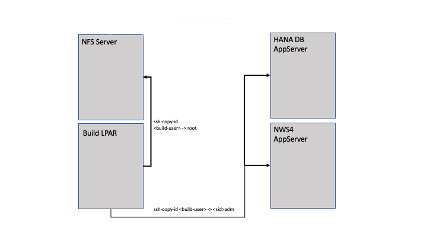

<!--
  ------------------------------------------------------------------------
  Copyright 2021, 2022 IBM Corp. All Rights Reserved.

  Licensed under the Apache License, Version 2.0 (the "License");
  you may not use this file except in compliance with the License.
  You may obtain a copy of the License at

      http://www.apache.org/licenses/LICENSE-2.0

  Unless required by applicable law or agreed to in writing, software
  distributed under the License is distributed on an "AS IS" BASIS,
  WITHOUT WARRANTIES OR CONDITIONS OF ANY KIND, either express or implied.
  See the License for the specific language governing permissions and
  limitations under the License.
 -------------------------------------------------------------------------->

# Prerequisites

In the following we describe how to prepare the required environment
such as the build LPAR, the NFS servers and the Red Hat® OpenShift®
helper and worker nodes for running an SAP® system in Red Hat
OpenShift Container Platform.

<!-- TOC-START -->

## Contents

<details>
  <summary>Table of Contents</summary>

- [Reference SAP® System](#reference-sap-system)
  - [Using the Standard SAP HANA® Filesystem Layout](#using-the-standard-sap-hana-filesystem-layout)
- [Red Hat OpenShift Container Platform](#red-hat-openshift-container-platform)
  - [Enabling Persistent OpenShift Registry Storage](#enabling-persistent-openshift-registry-storage)
  - [Required Users in Red Hat OpenShift Container Platform](#required-users-in-red-hat-openshift-container-platform)
  - [Enabling Multipathing with Kernel Arguments on RHCOS](#enabling-multipathing-with-kernel-arguments-on-rhcos)
- [Setting up the NFS Server](#setting-up-the-nfs-server)
- [Distributing the SSH Keys](#distributing-the-ssh-keys)
- [Enabling Password Authentication](#enabling-password-authentication)
- [Preparation Steps on the Helper Node](#preparation-steps-on-the-helper-node)
- [Preparation Steps on the Build LPAR](#preparation-steps-on-the-build-lpar)
  - [Additional Packages on the Build LPAR](#additional-packages-on-the-build-lpar)
  - [Additional Directories on the Build LPAR](#additional-directories-on-the-build-lpar)
  - [Setting up the Clone Repository](#setting-up-the-clone-repository)
  - [Preparing for Script Execution on the Build LPAR](#preparing-for-script-execution-on-the-build-lpar)
    - [Preparing the Virtual Environment](#preparing-the-virtual-environment)
    - [Activating the Virtual Environment](#activating-the-virtual-environment)
  - [Preparing the Credentials File](#preparing-the-credentials-file)
    - [Restarting the gpg-agent](#restarting-the-gpg-agent)
  - [Preparing the Configuration File](#preparing-the-configuration-file)
    - [Hints for the Parameters](#hints-for-the-parameters)
    - [Specifying the Memory Requests and Limits for Containers](#specifying-the-memory-requests-and-limits-for-containers)
    - [Considerations for SSH Passphrases](#considerations-for-ssh-passphrases)
    - [Name Resolution for Red Hat OpenShift Container Platform Services](#name-resolution-for-red-hat-openshift-container-platform-services)
    - [Name Resolution for the Reference SAP System](#name-resolution-for-the-reference-sap-system)
  - [Additional Prerequisites for Reference Systems Running on SLES](#additional-prerequisites-for-reference-systems-running-on-sles)
- [Red Hat OpenShift Container Platform Prerequisites](#red-hat-openshift-container-platform-prerequisites)
  - [Setting up the Worker Nodes](#setting-up-the-worker-nodes)
  - [Setting up the Registry](#setting-up-the-registry)
  - [Setting up the Project](#setting-up-the-project)
  - [Setting up the Permissions](#setting-up-the-permissions)
    - [Creating the Service Account](#creating-the-service-account)
    - [Adding the Security Context Constraint anyuid](#adding-the-security-context-constraint-anyuid)
    - [Adding the Security Context Constraint hostmount-anyuid](#adding-the-security-context-constraint-hostmount-anyuid)
  - [Setting up the Opaque Secret](#setting-up-the-opaque-secret)
  - [Verifying Red Hat OpenShift Container Platform Settings](#verifying-red-hat-openshift-container-platform-settings)
  - [Verifying the Configuration File](#verifying-the-configuration-file)

</details>

<!-- TOC-END -->

> **Note:** The prerequisites in this chapter apply to both Python tools and
> Red Hat Ansible® unless otherwise noted.

## Reference SAP® System

### Using the Standard SAP HANA® Filesystem Layout

We tested the containerization for SAP HANA systems having a standard
filesystem layout only:

```
   /hana/shared
   /hana/data
   /hana/log
``` 

## Red Hat OpenShift Container Platform

The solution requires a Red Hat OpenShift Container Platform 
installed on an IBM® Power Systems™ infrastructure.  The solution was
tested with Red Hat OpenShift Container Platform version 4.7 and versions above.

For details on the OCP installer see [OpenShift on IBM Power SystemVM servers managed using
HMC](https://github.com/ocp-power-automation/ocp4-upi-powervm-hmc) or
*Chapter 2.5 "Red Hat OpenShift setup with PowerVM"* in Redbook
[*Deploying SAP Software in Red Hat OpenShift on IBM Power
Systems*](https://www.redbooks.ibm.com/abstracts/redp5619.html).

### Enabling Persistent OpenShift Registry Storage

The persistent Red Hat OpenShift Container Platform registry storage
can be enabled as option in the OCP installer implemented as Ansible
playbook from the GitHub project [OpenShift on IBM Power SystemVM
servers managed using
HMC](https://github.com/ocp-power-automation/ocp4-upi-powervm-hmc). This
playbook has an option to deploy a persistent Red Hat OpenShift
registry storage on the NFS server hosted on the OCP helper node.

Set the parameter storage_type to `nfs` inside `vars-powervm.yaml`:

```
storage_type: nfs
```

The playbook will setup the nfs-provisioner, create a NFS-share on the
helper node, create a PV using the NFS share and claim the PV to the
registry and add access rules.

### Required Users in Red Hat OpenShift Container Platform

Two different user credentials are required in Red Hat OpenShift
Container Platform for preparing the environment and container
deployment:

- Red Hat OpenShift Container Platform cluster administrator

   The cluster administrator user is used to execute administration
   tasks in the OpenShift Container Platform such as
   
   - Preparing the runtime environment for the pod
   - Managing the *Security Context Constraints*
   - Creating *Opaque Secrets*
   - Checking the cluster setup

- Red Hat OpenShift Container Platform user

  A dedicated user on Red Hat OpenShift Container Platform is required
  for the solution. This user will be owner of an OpenShift project,
  and all the objects related to the SAP containerization will be
  assigned to this project.

  Additional users (beside default cluster administrator `kubeadmin`)
  are added to the cluster via an identity provider. See Red Hat
  OpenShift Container Platform documentation [*Configuring identity
  providers*](https://docs.openshift.com/container-platform/4.7/authentication/understanding-identity-provider.html)
  and *Chapter 2.6.1 "Configuring an HTPasswd identity provider"* in
  Redbook [*Deploying SAP Software in Red Hat OpenShift on IBM Power
  Systems*](https://www.redbooks.ibm.com/abstracts/redp5619.html) for
  further details.
  

### Enabling Multipathing with Kernel Arguments on RHCOS

Red Hat Enterprise Linux® CoreOS (RHCOS) is used as OS for all Red Hat
OpenShift Container Platform control and worker nodes. RHCOS supports
multipathing on the primary disk, allowing stronger resilience to
hardware failure to achieve higher host availability. Multipathing is
only supported when it is activated using the machine config as post
installation option.

See Red Hat OpenShift Container Platform documentation [*Enabling
multipathing with kernel arguments on
RHCOS*](https://docs.openshift.com/container-platform/4.7/post_installation_configuration/machine-configuration-tasks.html#rhcos-enabling-multipath_post-install-machine-configuration-tasks)
for further details.

## Setting up the NFS Server

> **Note:**
> We did all our tests running the NFS Server on our cluster helper node.
> Therefore we recommend to use your cluster helper node as your NFS Server. 

As part of the image build process, a snapshot copy of the SAP HANA
database belonging to the reference SAP system is created. The copy is
stored on a Network File System (NFS) server. The *hdb* container
deployed to the Red Hat OpenShift Container Platform will mount it
remotely via NFS to ensure persistence for the SAP HANA database.

Therefore an NFS server is required within your landscape which

- has sufficient storage capacity to store multiple copies of SAP HANA
  databases (order of magnitude: terabyte)

- can be reached via network from OpenShift worker nodes and build
  LPAR

- allows root access from the build LPAR via SSH.

Overlay filesystems for data `/hana/data` and log `/hana/log` are
created and NFS-exported on the NFS server for each specific SAP HANA
database deployment. Thus, multiple instantiations of SAP HANA
database instances can be derived from one single snapshot copy
without the need of a full storage footprint for each instantiation.

The solution ensures that all overlay filesystems and NFS exports are
still provided after a reboot of the NFS server:

- The overlay filesystems get automounted via the system and service
  manager `systemd` during the boot phase.

- The system and service manager `systemd` must be an integral part of
  the OS of the NFS server. (In case that the OpenShift Container
  Platform helper node acts as NFS server this prerequisite is fulfilled).

Some steps of the containerization process need to be executed on the
NFS Server with administrator permissions (root).

An administrative user is required on the NFS server, and its
credentials need to be known.

- Login to the NFS server as administrative user, and create an SSH
  key pair with an empty passphrase:

  ```shell
  $ ssh-keygen -t rsa -N '' -f ~/.ssh/id_rsa
  ```

## Distributing the SSH Keys


The picture below illustrates the required distribution public SSH
keys. A label

```shell
ssh-copy-id root -> <sid>adm
```

represents the requirement of adding the public SSH key of user `root`
on the source host to the `authorized_keys` file of user `<sid>adm` on
the target server.
  


The following public SSH keys need to be distributed:

| Source Host | Source User | Target Host | Target User |
|:-------|:-----|:-------|:-----|
|Build LPAR|\<build-user\>|NFS Server| root|
|Build LPAR|\<build-user\>|SAP HANA DB|\<hdb-sid\>adm|
|Build LPAR|\<build-user\>|SAP AppServer|\<sid\>adm|
|Build LPAR|\<build-user\>|OCP helper node|user able to connect as \<core\> user to worker nodes|

The SSH keys may be distributed manually, or the distribution can be
performed by running tool [`tools/ssh-keys`](./TOOLS.md#tool-ssh-keys)

If you want to use `tools/ssh-keys` you first must follow the steps described in section 
[*Preparing for Script Execution on the Build LPAR*](#preparing-for-script-execution-on-the-build-lpar)

> :warning: **Note: If you use Ansible:**
>
> - Only the manual SSH key distribution using `ssh-copy-id` is
>   currently supported.
>
> - The public SSH key of the build user must be copied to the
>   OpenShift helper node root user.
>
> 
> | Source Host | Source User | Target Host | Target User |
> |:-------|:-----|:-------|:-----|
> |Build LPAR|\<build-user\>|OpenShift helper node| root|

## Enabling Password Authentication 

Instead of using public key authentication you can use the password
authentication for accessing remote systems. If the user specifies the
passwords instead of SSH key files in the credentials configuration
`creds.yaml` then the tools will access the remote systems using *SSH
non-interactive mode*, without prompting for passwords. This *SSH
non-interactive mode* must be enabled with `PasswordAuthentication
yes` in the configuration file `/etc/ssh/sshd_config` on the remote
system. This is the default for the SSH daemon configuration in RHEL
OS. When you use a SLES OS as reference SAP system host you must
manually enable `PasswordAuthentication yes` in the configuration file
`/etc/ssh/sshd_config` on the remote system.

## Preparation Steps on the Helper Node

- Since some of the described actions are performed on the helper node
  of your cluster you need an account on this host.

## Preparation Steps on the Build LPAR

> :warning: It is recommended that the **build LPAR** is different
> from the **OC cluster helper node**. It is however possible to use
> the **OC cluster helper node** as **build LPAR**

All actions described in the following need to be executed on the
**build LPAR**

### Additional Packages on the Build LPAR

> **Note:** This section is a prerequisite for running the build with Python
> tools. The steps in this section are automated in Ansible.

- The following software packages need to be installed on your build
  LPAR:

  | Package    | Description |
  |:-----------|:----------|
  | `git`      | Version control system; must be installed for running Ansible Playbook too |
  | `podman`   | Tool for building container images and running containers |
  | `oc`       | Command line interface tool for Red Hat OpenShift |
  | `python3`  | Script interpreter; installed in *venv-setup* if not installed manually |
 
### Additional Directories on the Build LPAR

- During image build files are copied from your reference SAP system
  host to the build system. To store this data and the generated
  images you need a file system with at least 500 GB capacity. We
  assume in the following that this file system is mounted at
  directory `/data` on the build LPAR.

  The two subtrees `/var/lib/containers` and `/var/tmp` should be
  moved from the root `/` file system to the `/data` file system since
  they are heavily used during the image build process . This possibly
  leads to an unwanted 100% fill up of the root `/` file system.

  Run the following commands as user `root` on your build LPAR to
  move the two subtrees from the root `/` file system to the `/data`
  file system:

  ```shell
  $ mkdir -p /data/var/lib
  $ mv /var/lib/containers /data/var/lib/containers
  $ ln -s /data/var/lib/containers /var/lib/containers

  $ mkdir -p /data/var/
  $ mv /var/tmp /data/var/tmp
  $ ln -s /data/var/tmp /var/tmp
  ```

### Setting up the Clone Repository

- You need a clone of this GitHub repository on your build
  LPAR. Create the clone by logging into the build LPAR and
  running the command

  ```shell
  $ git clone https://github.com/IBM/containerization-for-sap-s4hana.git
  ```

- After `git clone` has finished change to the working directory:

  ```shell
    $ cd containerization-for-sap-s4hana
  ```
### Preparing for Script Execution on the Build LPAR

#### Preparing the Virtual Environment

> **Note:** This section is a prerequisite for running the build with Python tools.
> It is automated when you execute the build using Ansible.

- Prepare the virtual environment within the repository clone:

  Change to the directory of the cloned repository and execute
  [`tools/venv-setup`](./TOOLS.md#tool-venv-setup)

  ```shell
  $ cd containerization-for-sap-s4hana
  $ tools/venv-setup
  ```
  
  The script will setup a Python virtual environment with all the
  modules required to run the tools.

#### Activating the Virtual Environment

> **Note:** This section is a prerequisite for running the build with Python tools.
> It is automated when you execute the build using Ansible.

Change to the directory of the cloned repository and activate the
virtual environment:

  ```shell
  $ cd containerization-for-sap
  $ source venv/bin/activate
  ```

### Preparing the Credentials File

> **Note:** This section is a prerequisite for running the build with Python tools.
> It is automated when you execute the build using Ansible.

The credentials file contains information about the user credentials of the 
- Reference SAP system
  - OS User credentials for SAP and SAP HANA instances
  - ABAP Connect User
- Red Hat OpenShift Container Platform
  - Cluster admin
  - Project user
- NFS server admin

Tool [`creds`](./TOOLS.md#tool-creds) is available to
  - interactively create a new encrypted credentials file (`-n`)
  - interactively edit an existing encrypted credentials file (`-e`)
  - dump the contents of an existing encrypted credentials file (`-d`)

Create a new credentials file using 
```shell
$ tools/creds -n 
```
and supply all the credentials information as requested.

The credentials file is encrypted using GPG.

- If you specify a GPG key via the recipient option (`-r`), then
  asymmetric encryption is used. You can generate a GPG key for the
  build user in advance e.g. using
  [`gpg-key-gen`](./TOOLS.md#tool-gpg-key-gen).

- If no GPG key is specified, then symmetric encryption is used.

> :warning: **Always use a copy of the `creds.yaml.template` as your credentials file!**

#### Restarting the gpg-agent
When you use an encrypted credentials file and encounter problems with starting 
tools stop the `gpg-agent` by issuing 
```shell
$ gpgconf --kill gpg-agent
```

The `gpg-agent` will automatically restart when the encrypted credentials file is accessed next time.

### Preparing the Configuration File

> **Note:** This section is a prerequisite for running the build with Python tools.
> It is automated when you execute the build using Ansible.

The configuration file contains all information about the reference
SAP system, the Red Hat OpenShift Container Platform and the NFS
server which is required to build the container images and deploy and
run them in your cluster.

You can create your configuration file in two ways:

- By copying the configuration file template named
  [`config.yaml.template`](../config.yaml.template). This template is
  located in the root directory of your repository clone.  Copy the
  file to a new file named `config.yaml` in the root directory of your
  repository clone and adapt it as needed.  Explanations of the
  various parameters are provided in the configuration file
  template.

> :warning: **Always use a copy of the `config.yaml.template` as your configuration file!**

- By executing

  ```shell
  $ tools/config -n 
  ```

  and supplying all parameters as requested. 

#### Hints for the Parameters

- In case the SAP system is installed with virtual hostnames:

  Enter the virtual hostname ("SAPLOCALHOST") of the SAP instance as
  `refsys.nws4.host.name`

- Do not specify the fully qualified domain name as hostname. Use the short
hostname instead.

#### Specifying the Memory Requests and Limits for Containers

The memory resources *requests* and *limits* are used for setting up the container memory resources.
For more information on how to setup the memory requests see:
https://kubernetes.io/docs/concepts/configuration/manage-resources-containers

If you do not specify a value for the `resources.limits.memory` or the
`resources.requests.memory`, default values are used:

Container Type | Default Size
------------ | -------------
ASCS | 10Gi
DI | Value of `PHYS_MEMSIZE` in SAP instance profile, if not available: 10% of the total memory of the reference SAP system host. 
SAP HANA DB | Calculated from the original size of the reference SAP system

> :warning: **The value of `resources.limits.memory` must be at least
> the size of the `resources.requests.memory`.  If you do not specify
> a value for `resources.limits.memory` and the calculated size is
> less than the specified value for `resources.requests.memory`,
> generation of the deployment file using tool
> [`ocp-deployment gen-yaml`](./TOOLS.md#tool-ocp-deployment) fails.
> Use the [`verify-config`](./TOOLS.md#tool-verify-config) tool to
> make sure that your memory settings are valid.**


#### Considerations for SSH Passphrases

- During the image build and deployment process multiple SSH
  connections are established from the build LPAR to the NFS server
  and to the host on which the reference SAP system is installed.  To
  avoid having to enter the SSH key passphrase or the login
  credentials on each SSH connection start it is recommend to

  - either run all actions described below under an `ssh-agent`
    session (see https://www.ssh.com/ssh/agent)
  - or use a passphrase-less SSH key for connecting to the respective
    systems (see https://www.redhat.com/sysadmin/passwordless-ssh).


#### Name Resolution for Red Hat OpenShift Container Platform Services 

> **Note:** This section is a prerequisite for running the build with Python tools.
> It is automated when you execute the build using Ansible.

- Ensure that the build LPAR can resolve all relevant IP addresses
  of the Red Hat OpenShift Container Platform cluster:

  As part of the execution of the containerization scripts, there will
  be attempts to log into the OpenShift Container Platform and to push
  images into the cluster registry. To enable cluster login and
  connections to the local cluster registry from your build LPAR
  entries need to be added to the `/etc/hosts` file of the build
  LPAR.
  
  Use the tool

  ```
  tools/ocp-etc-hosts
  ```
  
  to add the needed entries to the `/etc/hosts` file of your build LPAR. 
  
  You require both a valid credentials file and a valid configuration
  file for running [`ocp-etc-hosts`](./TOOLS.md#tool-ocp-etc-hosts)
  (see also sections [*Preparing the credentials
  file*](#preparing-the-credentials-file) and [*Preparing the
  configuration file*](#preparing-the-configuration-file)).
   
  Call this tool only in case your build is not running on the helper
  node.

#### Name Resolution for the Reference SAP System

  Verify that the build LPAR can resolve all physical/virtual
  hostnames related to the SAP instances of the reference SAP system.
  In case that name(s)/addresse(s) are not resolved via DNS, those
  need to be added manually to the `/etc/hosts` file of the build
  LPAR.
  
### Additional Prerequisites for Reference Systems Running on SLES

Newer SAP HANA releases may require additional GCC C++ runtime
compatibility libraries. Package `compat-sap-c++`, part of the  
**Red Hat Enterprise Linux for SAP Solutions** subscription
`rhel-8-for-ppc64le-sap-netweaver-rpms`, provides the additional
library packages. These libraries are installed independently
to the standard GCC runtime libraries in RHCOS.

| SAP HANA 2.0 SP Level | compatibility library |
|:----------------------|:-------------------------------|
| up to SAP HANA 2.0 SPS 04   |none                |
| SAP HANA 2.0 SPS 05   |`compat-sap-c++-9`  |
| SAP HANA 2.0 SPS 06   |`compat-sap-c++-10` |

If your reference SAP system has a SAP HANA 2.0 SP Level 5 and above,
you need to provide the appropriate rpm fileset for `compat-sap-c++`
in the default directory `/tmp/soos/rpm-packages/` on your build
LPAR.

The table below lists the required rpm packages:

| SAP HANA 2.0 SP Level | compatibility library |
|:----------------------|:-------------------------------|
| SAP HANA 2.0 SPS 05   |`compat-sap-c++-9-9.1.1-2.2.el8.ppc64le.rpm`  |
| SAP HANA 2.0 SPS 06   |`compat-sap-c++-10-10.2.1.1.el8_2.ppc64le.rpm` |

## Red Hat OpenShift Container Platform Prerequisites

### Setting up the Worker Nodes

The SAP workload requires some specific settings on all worker nodes:

- Disabling SELinux

  You can check the SELinux status on the worker nodes by executing

  ```shell
  $ ssh core@<worker_hostname> "getenforce"
  ```

  on your helper node.

- Setting the PID limit for a container to at least 8192

  You can check the PID limit on the worker nodes by executing


  ```shell
  $ "crio config 2>/dev/null | grep 'pids_limit'"
  ```

  on every worker node.

For more information on how to disable SELinux and set the runtime
limits on the worker nodes refer to
https://docs.openshift.com/container-platform/4.7/post_installation_configuration/machine-configuration-tasks.html#nodes-nodes-kernel-arguments_post-install-machine-configuration-tasks
or *Chapter 2.6 "Postinstallation tasks"* in Redbook [*Deploying SAP
Software in Red Hat OpenShift on IBM Power System
Systems*](https://www.redbooks.ibm.com/abstracts/redp5619.html).

### Setting up the Registry

> **Note:** This section is a prerequisite for running the build with Python tools.
> It is automated when you execute the build using Ansible.

The default route to the internal registry of the Red Hat OpenShift
Container Platform cluster needs to be enabled. For more information
see
https://docs.openshift.com/container-platform/4.7/registry/configuring-registry-operator.html#registry-operator-default-crd_configuring-registry-operator

### Setting up the Project

> **Note:** This section is a prerequisite for running the build with Python tools.
> It is automated when you execute the build using Ansible.

All cluster related activities described in the following are executed
in the context of a Red Hat OpenShift Container Platform project. To
create such a project proceed as follows:

- Log into the cluster with your cluster user name:

  ```shell
  $ oc login --insecure-skip-tls-verify=true https://api.<ocp-cluster-domain>:6443 -u <ocp-user-name>
  ```

- Create a new project:

  ```shell
  $ oc new-project <ocp-project-name>
  ```

### Setting up the Permissions

> **Note:** This section is a prerequisite for running the build with Python tools.
> It is automated when you execute the build using Ansible.

Access to additional *Security Context Constraints (SCC)* must be
granted to be able to run the containers in your project in privileged
mode.  It is necessary to modify the SCC so that the pod gets further
permissions beyond *restricted*.

The SAP HANA container mounts the database `data/`- and
`log/`-directories via NFS. NFS mounting for the container(s) requires
a service account with appropriate SCCs.

Necessary steps to grant those permissions are described in the
following.

#### Creating the Service Account

To create the service account proceed as follows:

  - Run the command

    ```shell
    $ tools/ocp-service-account-gen
    ```

    to generate the service account in your Openshift Container Platform project.

    You require both a valid credentials file and a valid
    configuration file for running
    [`ocp-service-account-gen`](./TOOLS.md#tool-ocp-service-account-gen)
    (see sections [*Preparing the credentials
    file*](#preparing-the-credentials-file) and [*Preparing the
    configuration file*](#preparing-the-configuration-file)).

> **Note:** Logon into the Red Hat OpenShift Container Platform cluster
> as cluster administrator
>   ```shell
> $ tools/ocp-login -a 
>   ```
> before you execute the steps below.

#### Adding the Security Context Constraint anyuid
  
Run

  ```shell
  $ oc adm policy add-scc-to-group anyuid "system:serviceaccounts:<ocp-project-name>"
  ```

to add the SCC *anyuid* to the group.

#### Adding the Security Context Constraint hostmount-anyuid

The SAP HANA container mounts the database `data/`- and
`log/`-directories via NFS. To allow NFS mounting for the container a
service account with corresponding *Security Context Constraints
(SCC)* is required.

  - Now add the required security context constraints to the service
    account:

    ```shell
    $ oc adm policy add-scc-to-user hostmount-anyuid system:serviceaccount:<ocp-project-name>:<ocp-project-name>-sa
    ```

### Setting up the Opaque Secret 

> **Note:** This section is a prerequisite for running the build with Python tools.
> It is automated when you execute the build using Ansible.

> **Note:** This step is required only if your reference SAP system is a
> distributed SAP system.

If you want to use a distributed SAP system as a reference SAP system, the
target system will run in one Pod. In this case it is necessary to
adapt the *hdbuserstore*. Therefore you must specify a secret
containing the credentials of the ABAP connect user for your SAP HANA
DB in your credentials file.

To create this secret submit the following command:

```shell
$ tools/ocp-hdb-secret-gen
```

You require both a valid credentials file and a valid configuration
file for running
[`ocp-hdb-secret-gen`](./TOOLS.md#tool-ocp-hdb-secret-gen) (see
sections [*Preparing the credentials
file*](#preparing-the-credentials-file) and [*Preparing the
configuration file*](#preparing-the-configuration-file)). Ensure that
the name for the secret starts and ends with an alphanumeric
character, and consists only of lower case alphanumeric characters,
`-` or `.`.

### Verifying Red Hat OpenShift Container Platform Settings

> **Note:** This section is a prerequisite for running the build with Python tools.
> It is automated when you execute the build using Ansible.

To verify your cluster settings run the following command:

```shell
  $ tools/verify-ocp-settings
```

You require both a valid credentials file and a valid configuration
file for running
[`verify-ocp-settings`](./TOOLS.md#tool-verify-ocp-settings) (see
sections [*Preparing the credentials
file*](#preparing-the-credentials-file) and [*Preparing the
configuration file*](#preparing-the-configuration-file)).

### Verifying the Configuration File

> **Note:** This section is a prerequisite for running the build with Python tools.
> It is automated when you execute the build using Ansible.

Run the following command to verify the correctness of the parameters
in your configuration file:

```shell
$ tools/verify-config
```

You require both a valid credentials file and a valid configuration
file for running [`verify-config`](./TOOLS.md#tool-verify-config) (see
sections [*Preparing the credentials
file*](#preparing-the-credentials-file) and [*Preparing the
configuration file*](#preparing-the-configuration-file)).
